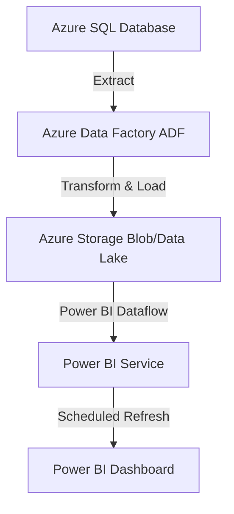
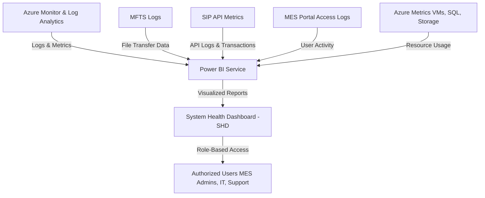

# Powerbi-Reporting

### **Steps on Application Configuration for the System Health Dashboard (SHD) in Power BI**  

To configure the **System Health Dashboard (SHD)** for monitoring **MFTS, SIP, MES Portal, and Azure Metrics**, follow these steps:

---

## **1️⃣ Set Up Data Sources & Connect to Power BI**
### **Step 1: Configure Data Sources in Azure**  
✅ **Azure Log Analytics Configuration**  
   - Go to **Azure Portal** → Navigate to **Log Analytics Workspace**.  
   - Enable **Diagnostic Settings** for:
     - **MFTS (File Transfer Metrics)**
     - **SIP (API Logs)**
     - **MES Portal (Authentication Logs)**
     - **Azure Resources (VMs, Storage, SQL)**  
   - Select **"Send to Log Analytics"** and define the retention policy.  

✅ **Azure Storage Configuration for MFTS Logs**  
   - Create an **Azure Storage Account**.  
   - Enable **Storage Analytics Logging** to track file transfers.  

✅ **ServiceNow API Configuration (For Incident Management Data)**  
   - In ServiceNow, go to **System Web Services → REST API Explorer**.  
   - Generate API endpoint:  
     ```
     https://your-instance.service-now.com/api/now/table/incident
     ```
   - Create a service account with **read-only permissions** to fetch incident logs.  

✅ **Azure SQL Configuration (For Transaction & SLA Data)**  
   - Deploy **Azure SQL Database**.  
   - Set up **tables for transactional data** (e.g., Claims Processing, Provider Requests).  
   - Configure **Row-Level Security (RLS) for role-based access control**.  

---

## **2️⃣ Power BI Data Connection Setup**
### **Step 2: Connect Data Sources to Power BI**
✅ **Connect to Azure Log Analytics**  
   - Open **Power BI Desktop** → Click **Get Data** → Select **Azure Monitor Logs**.  
   - Enter the **Log Analytics Workspace ID & Key**.  
   - Use **KQL Queries** to pull system health data:  
     ```kql
     AzureDiagnostics
     | where ResourceType == "APIManagementService"
     | summarize AvgLatency=avg(ResponseTime) by bin(TimeGenerated, 1h)
     ```

✅ **Connect to Azure Storage for MFTS Logs**  
   - Go to **Get Data → Azure Blob Storage**.  
   - Enter the **Storage Account Name & Key**.  
   - Load **file transfer logs for MFTS performance tracking**.  

✅ **Connect to ServiceNow API for ITSM Data**  
   - Go to **Get Data → Web Connector**.  
   - Enter **ServiceNow API URL** and credentials.  
   - Select **incident fields** such as **status, priority, resolution time**.  

✅ **Connect to Azure SQL for Transaction Data**  
   - Go to **Get Data → Azure SQL Database**.  
   - Enter **server name, database name, and credentials**.  
   - Use SQL query to fetch key metrics:  
     ```sql
     SELECT 
       TransactionID, ServiceName, ResponseTime, ErrorRate, Timestamp 
     FROM TransactionLogs
     WHERE Timestamp >= DATEADD(DAY, -30, GETDATE())
     ```

---

## **3️⃣ Configure Data Modeling & Relationships**
### **Step 3: Define Data Relationships**
✅ **Establish Relationships in Power BI Model View**  
   - **MFTS Logs ↔ SIP API Logs ↔ MES User Activity ↔ Azure SQL Transactions**.  
   - Use **common keys** (e.g., `TransactionID`, `UserID`, `ServiceName`).  

✅ **Create Custom Measures in DAX for Performance Metrics**  
   - **API Success Rate:**  
     ```DAX
     SuccessRate = DIVIDE([Successful Transactions], [Total Transactions], 0)
     ```
   - **System Uptime Percentage:**  
     ```DAX
     Uptime = (1 - [Downtime Hours] / 24) * 100
     ```
   - **SLA Compliance Calculation:**  
     ```DAX
     SLACompliance = IF([ResponseTime] < 200, "Compliant", "Non-Compliant")
     ```

---

## **4️⃣ Configure Role-Based Access Control (RBAC)**
### **Step 4: Implement Security & Permissions**
✅ **Set Row-Level Security (RLS) in Power BI**  
   - Define roles for different **user groups** (Admins, Analysts, IT Support).  
   - **DAX Example for Restricted Access:**  
     ```DAX
     UserTable[Department] = USERPRINCIPALNAME()
     ```

✅ **Enable Azure Entra ID (Azure AD) for Authentication**  
   - Configure **Power BI Service Authentication** via **Azure AD**.  
   - Restrict access to **authorized Medicaid IT personnel only**.  

✅ **Apply Sensitivity Labels in Power BI**  
   - Use **Microsoft Information Protection (MIP)** to classify reports:
     - **Confidential** – SLA & transaction data.  
     - **Restricted** – Authentication logs & security events.  

---

## **5️⃣ Build Power BI Dashboards & Visuals**
### **Step 5: Design System Health Dashboard**
✅ **Create KPI Indicators for Real-Time Monitoring**  
   - Use **Conditional Formatting** for SLA compliance (✅ Green: OK, ⚠️ Yellow: Warning, ❌ Red: Issue).  
   - **Example KPI Cards:**  
     - **Service Uptime (%)**  
     - **API Latency (ms)**  
     - **MFTS Transfer Success Rate**  

✅ **Implement Drill-Through Reports for Root Cause Analysis**  
   - Users should **click an API failure rate metric** and see **detailed error logs**.  

✅ **Optimize Power BI Dashboard Performance**  
   - Limit visual elements per report page.  
   - Use **Aggregated Tables** for large datasets.  
   - Implement **Query Folding** in Power Query.  

---

## **6️⃣ Configure Scheduled Refresh & Monitoring**
### **Step 6: Automate Data Refresh & Performance Monitoring**
✅ **Set Up Scheduled Refresh in Power BI Service**  
   - **Go to Power BI Service → Datasets → Scheduled Refresh**.  
   - Configure **refresh frequency** based on data latency:
     - **Azure Monitor & API Logs** → Every **15 minutes**.  
     - **MFTS & ServiceNow Logs** → Every **30 minutes**.  
     - **Transaction Data (SQL)** → Every **1 hour**.  

✅ **Enable Alerts for Critical Failures**  
   - Use **Azure Monitor** to trigger alerts when:
     - **Service Uptime < 99%**  
     - **API Latency > 500ms**  
     - **MFTS Error Rate > 5%**  

✅ **Monitor Power BI Report Performance**  
   - Track **dashboard load times** and optimize queries.  

---

## **7️⃣ Deployment & Maintenance**
### **Step 7: Deploy & Maintain SHD Application**
✅ **Use Power BI Deployment Pipelines**  
   - Deploy dashboards across **Dev, Test, and Production environments**.  

✅ **Enable Power BI Usage Analytics**  
   - Monitor **user activity, report interactions, and refresh success rates**.  

✅ **Regularly Review Data Security & Compliance**  
   - Audit access logs to ensure **RBAC policies are enforced**.  
   - Update **data retention policies** for compliance with **HIPAA & Medicaid guidelines**.  

---

## **🎯 Conclusion**
By following these **application configuration steps**, the **System Health Dashboard (SHD) in Power BI** will be fully integrated with **Azure Monitor, Log Analytics, ServiceNow, and SQL databases**, enabling **real-time insights, proactive monitoring, and data-driven decision-making** for Medicaid operations. 🚀

### **Expanded Guide: Connecting Azure SQL for Transaction Data (SQL → ADF → Azure Storage → Power BI)**  

This section provides a detailed step-by-step guide for **ingesting, transforming, and visualizing transaction data from Azure SQL into Power BI** using **Azure Data Factory (ADF) and Azure Storage**. This architecture ensures **scalability, data transformation efficiency, and optimal Power BI performance**.

---

## **1️⃣ Architecture Overview**  



### **Key Components in the Architecture**
- **Azure SQL Database**: Stores **transactional data** (e.g., claims, service requests, provider activity).  
- **Azure Data Factory (ADF)**: Extracts, transforms, and loads (ETL) data from **Azure SQL into Azure Storage**.  
- **Azure Storage (Blob or Data Lake Storage Gen2)**: Acts as an intermediary **staging layer** for Power BI to efficiently query data.  
- **Power BI Service**: Connects to **Azure Storage** and visualizes the **transaction data**.  

---

## **2️⃣ Step-by-Step Implementation**
### **Step 1: Configure Azure SQL Database for Transaction Data**
✅ **Create an Azure SQL Database**  
   - Navigate to **Azure Portal → Azure SQL Database**.  
   - Click **"Create Database"**, select **Resource Group**, and configure performance tier.  
   - Define tables for transactional data:  
     ```sql
     CREATE TABLE Transactions (
         TransactionID INT PRIMARY KEY,
         ServiceName NVARCHAR(100),
         ResponseTime INT,
         ErrorRate DECIMAL(5,2),
         CreatedAt DATETIME
     );
     ```

✅ **Enable Firewall & Networking for ADF Access**  
   - Navigate to **SQL Server → Firewall Rules**.  
   - Add **ADF’s IP address range** to allow secure access.  

✅ **Create a Read-Optimized View for ETL**  
   - To improve extraction performance, create a **materialized view**:  
     ```sql
     CREATE VIEW vw_TransactionSummary AS
     SELECT 
         TransactionID, ServiceName, ResponseTime, 
         ErrorRate, CreatedAt
     FROM Transactions
     WHERE CreatedAt >= DATEADD(DAY, -30, GETDATE());
     ```

---

### **Step 2: Configure Azure Data Factory (ADF)**
✅ **Create an ADF Pipeline to Extract Data from SQL**  
   - Navigate to **Azure Portal → Azure Data Factory → Create Pipeline**.  
   - **Add a "Copy Data" Activity**.  
   - **Source**: Connect to **Azure SQL Database**, select **"vw_TransactionSummary"**.  
   - **Destination**: Set as **Azure Blob Storage (Parquet/CSV format)**.  

✅ **Schedule the ADF Pipeline**  
   - In ADF, navigate to **Triggers → New/Edit Schedule**.  
   - Define **incremental refresh** frequency (e.g., **every 30 minutes or hourly**).  

✅ **Optimize Data Transfer with Partitioning**  
   - Use **Incremental Data Load** with **CreatedAt column**:  
     ```sql
     SELECT * FROM vw_TransactionSummary WHERE CreatedAt > ?
     ```

---

### **Step 3: Store Data in Azure Storage (Blob or Data Lake)**
✅ **Choose Storage Type**  
   - **Azure Blob Storage**: Stores **CSV/Parquet files** for cost-effective storage.  
   - **Azure Data Lake Storage Gen2**: Provides **hierarchical namespace and fine-grained security**.  

✅ **Optimize Data Storage Format for Power BI**  
   - **Use Parquet Format** for optimized **query performance** in Power BI.  
   - **Partition Data by Date** to speed up queries:  
     ```
     /transactions/year=2025/month=03/day=10/transactions.parquet
     ```

✅ **Enable Lifecycle Policies**  
   - Configure **automatic deletion** for old files beyond **90 days** to optimize storage costs.  

---

### **Step 4: Connect Azure Storage to Power BI**
✅ **Configure Power BI Dataflow to Read from Azure Storage**  
   - **Power BI Service → Dataflows → New Dataflow**.  
   - Select **"Azure Blob Storage" or "Azure Data Lake"** as the data source.  
   - **Connect using Storage Account Key or Managed Identity**.  
   - Select **"transactions.parquet"** file and load into Power BI.  

✅ **Transform Data in Power Query**  
   - **Filter data** to remove duplicates or unnecessary columns.  
   - Convert **timestamps into local timezone format**.  
   - Aggregate data for **faster report loading** (e.g., average response time by service).  

✅ **Schedule Refresh in Power BI Service**  
   - Navigate to **Dataset Settings → Scheduled Refresh**.  
   - Set refresh frequency **(every 30 minutes or as needed)**.  

---

### **Step 5: Create Power BI Visualizations**
✅ **Design Key Metrics in Power BI Dashboard**  
   - **KPI Cards for Real-Time Monitoring**  
     - 🟢 **Service Uptime (%)**  
     - 📊 **API Latency (ms)**  
     - ✅ **Transaction Throughput (TPS)**  
   - **Time-Series Charts**  
     - **Response Time Trends by Service**  
     - **Error Rate % Over Time**  
   - **Drill-Down Reports**  
     - Click **on failed transactions** to view **detailed API logs**.  

✅ **Apply Row-Level Security (RLS)**  
   - Define **RLS roles for different user groups** in Power BI.  
   - Example:  
     ```DAX
     [Department] = USERPRINCIPALNAME()
     ```

---

## **3️⃣ Summary: Why Use This Approach?**
✅ **Performance Optimization**:  
   - ADF extracts only **incremental changes**, reducing **query load on Azure SQL**.  
   - Parquet files in **Azure Storage** provide **faster read performance for Power BI**.  

✅ **Scalability**:  
   - Supports **millions of transactions** without slowing down Power BI reports.  
   - Power BI **queries pre-processed data** instead of **running expensive SQL queries**.  

✅ **Security & Compliance**:  
   - **RBAC-controlled access to Azure SQL, Storage, and Power BI reports**.  
   - **Audit logs & encryption policies enforced** via Azure Security Center.  

🚀 **Final Outcome**: A **scalable, secure, and real-time transaction monitoring solution** using **Azure SQL, ADF, Storage, and Power BI**.


### **7.1 Best Practices for System Health Dashboard (SHD) in Power BI**  

Ensuring the **System Health Dashboard (SHD)** delivers **accurate, real-time insights** while maintaining **performance, security, and scalability** requires adherence to **best practices**. Below are key recommendations for optimizing **data integration, visualization, security, and efficiency** when working with **Power BI, MFTS, SIP, MES Portal, and Azure Metrics**.

---

## **1️⃣ Data Integration & Connectivity Best Practices**
🔹 **Use DirectQuery for Real-Time Metrics**  
   - Instead of relying on imported datasets, **DirectQuery** enables Power BI to **query data live from Azure Monitor, Log Analytics, and SQL databases**.  
   - **Example:** Fetching **SIP API response times** directly from **Azure Monitor Logs** ensures up-to-date API latency tracking.  

🔹 **Optimize Scheduled Refresh for Near Real-Time Data**  
   - **Set refresh intervals based on data update frequency** (e.g., every **15 minutes for API logs**, every **hour for storage metrics**).  
   - **Use Incremental Refresh** to load only new data instead of reloading the entire dataset.  
   - **Example:** Refresh **Azure Storage MFTS logs** every 30 minutes while keeping incident reports on a **4-hour refresh cycle**.  

🔹 **Use Power BI Dataflows for Pre-Processing**  
   - Offload **heavy data transformations** to **Power BI Dataflows** instead of processing large datasets on the report side.  
   - **Example:** Transforming **ServiceNow incident logs** before loading them into Power BI improves performance.  

🔹 **Use Azure Data Factory for ETL Operations**  
   - For large-scale transformations, use **Azure Data Factory** to **extract, transform, and load (ETL)** data into **Azure SQL or Storage** before Power BI reads it.  
   - **Example:** Collecting **MFTS transaction logs**, filtering out irrelevant data, and storing it in an optimized **Azure SQL table**.

---

## **2️⃣ Performance Optimization for Power BI Reports**
🔹 **Reduce Data Model Size with Aggregations**  
   - Implement **aggregated tables** in Power BI for high-cardinality datasets like **transaction logs and API metrics**.  
   - Use **pre-aggregated data views** in **Azure SQL** to reduce load time for Power BI queries.  

🔹 **Optimize DAX Queries**  
   - Use **variables** (`VAR`) in DAX to improve performance by reducing repeated calculations.  
   - Avoid using **FILTER() inside CALCULATE()**, as it can slow down queries.  
   - **Example DAX Optimization:**  
     ```DAX
     VAR SuccessRate = DIVIDE([Successful Transactions], [Total Transactions], 0)
     RETURN SuccessRate
     ```

🔹 **Leverage Power BI Composite Models**  
   - Combine **Import Mode for static datasets** (e.g., configuration data) and **DirectQuery for dynamic data** (e.g., SIP API logs).  
   - **Example:** Load **historical ServiceNow ticket data** in **Import Mode**, while using **DirectQuery for live SLA compliance tracking**.  

🔹 **Optimize Query Folding in Power Query**  
   - Use query folding to **push data transformations** to the source system, reducing load on Power BI.  
   - **Example:** Instead of filtering data in Power BI, apply **WHERE conditions** in Azure SQL to return only **relevant incident logs**.

---

## **3️⃣ Security & Access Control Best Practices**
🔹 **Implement Row-Level Security (RLS) for Role-Based Access**  
   - Restrict **Power BI dashboard views** based on user roles.  
   - Example RLS Rules:
     - **MES Admins** → Full system health reports.  
     - **SIP Engineers** → API and integration logs only.  
     - **Security Teams** → Authentication failures and compliance reports.  
   - **DAX Example for RLS**:  
     ```DAX
     UserTable[Department] = USERPRINCIPALNAME()
     ```

🔹 **Secure API Keys & Credentials**  
   - Store **ServiceNow API keys, Azure SQL credentials, and Log Analytics workspace IDs** securely using **Azure Key Vault** instead of hardcoding them.  

🔹 **Apply Power BI Sensitivity Labels**  
   - Use **Microsoft Information Protection (MIP)** to classify reports containing **PII or financial data**.  
   - Example:
     - **Confidential** – Financial claims and provider payment data.  
     - **Restricted** – Patient-sensitive logs.  

🔹 **Enable Multi-Factor Authentication (MFA) for Access**  
   - Require **MFA for Power BI Service access**, especially for admins with **privileged access to MES reports**.  

---

## **4️⃣ Visualization & Usability Best Practices**
🔹 **Use KPI Indicators for System Health Monitoring**  
   - Implement **color-coded indicators** to highlight anomalies:
     - **🟢 Green** – System Healthy  
     - **🟡 Yellow** – Performance Degrading  
     - **🔴 Red** – Critical Failure  
   - Example: **SLA compliance below 95% triggers a red warning on the dashboard.**  

🔹 **Enable Drill-Through Reports for Root Cause Analysis**  
   - Users should **click an error count** and drill through to **detailed API failure logs or ServiceNow incident tickets**.  

🔹 **Design Dashboards for Different User Personas**  
   - **Executives** → Summary KPIs & SLA compliance.  
   - **IT Operations** → System uptime & error trends.  
   - **Developers** → Detailed API logs & response times.  

🔹 **Limit Visual Elements Per Page for Performance**  
   - Avoid too many visuals per page; **optimize rendering speed** by **grouping related insights** into separate reports.  
   - **Example:** Separate **MFTS Metrics, SIP API Performance, and MES Portal Logs** into different tabs instead of one crowded dashboard.  

---

## **5️⃣ Monitoring & Maintenance Best Practices**
🔹 **Set Up Power BI Data Refresh Alerts**  
   - Configure **failure alerts** if dataset refresh **fails multiple times**.  
   - Example: **Use Azure Monitor to trigger an email alert if Power BI fails to refresh data from ServiceNow API.**  

🔹 **Monitor Power BI Performance in the Admin Portal**  
   - Regularly check **Power BI capacity usage** to **identify slow-loading reports or bottlenecks**.  

🔹 **Enable Usage Analytics to Track Report Interactions**  
   - Use **Power BI Service Usage Metrics** to track **which users access dashboards and how frequently**.  
   - Example: **Identify underutilized reports to optimize dashboard design.**  

🔹 **Implement Version Control for Power BI Reports**  
   - Use **Power BI Deployment Pipelines** to manage **Dev, Test, and Production versions** of dashboards.  

---

### **Conclusion**
By following these best practices, the **System Health Dashboard (SHD)** will remain **scalable, secure, and high-performing**, enabling **Medicaid IT teams to proactively monitor** the health of **SIP, MFTS, MES Portal, and Azure environments** in Power BI. 🚀

### **Developer’s Guide: System Health Dashboard (SHD) in Power BI for MFTS, SIP, MES Portal, and Azure Metrics**  

#### **Introduction**  
The **System Health Dashboard (SHD)** provides a **real-time operational view** of the **Managed File Transfer System (MFTS)**, **System Integration Platform (SIP)**, **Medicaid Enterprise System (MES) Portal**, and **Azure Metrics**. This guide outlines **data integration, Power BI setup, and best practices** for implementing the SHD.

---

## **1. Architecture Overview**  
The SHD aggregates data from **multiple Azure services**, **log sources**, and **ServiceNow** to create a **unified performance dashboard**.  

### **1.1 Data Flow Overview**  


---

## **2. Data Sources and Integration**  
SHD retrieves data from various sources to monitor **system performance, security, and service reliability**.

| **Source**  | **Data Collected**  | **Integration Method**  |
|-------------|--------------------|------------------------|
| **MFTS Logs**  | File transfer status, success/failure rate, throughput | Azure Storage → Log Analytics → Power BI |
| **SIP API Logs**  | API response time, transaction errors, uptime | Azure API Management → Log Analytics → Power BI |
| **MES Portal**  | User authentication logs, session tracking | Azure Entra ID → Log Analytics → Power BI |
| **Azure Metrics**  | VM CPU, memory, disk, network usage | Azure Monitor → Log Analytics → Power BI |
| **ServiceNow**  | Incident management, SLA compliance | ServiceNow API → Power BI |

---

## **3. Power BI Setup and Configuration**  
### **3.1 Data Connection in Power BI**  
1. **Get Data → Select "Azure Monitor Logs"**  
   - Navigate to **Power BI Desktop** → Click **Get Data** → Choose **Azure Monitor Logs**.  
   - Enter the **Log Analytics Workspace ID & Key**.  
   - Use **KQL queries** to retrieve system metrics.  

2. **Connect to Azure Storage for MFTS Data**  
   - Select **Azure Blob Storage**.  
   - Load **MFTS transfer logs** for processing.  

3. **ServiceNow API Connection** (For Incident Management)  
   - Use the **Power BI Web Connector**.  
   - Enter ServiceNow API URL:  
     ```
     https://your-instance.service-now.com/api/now/table/incident
     ```
   - Authenticate using **OAuth 2.0** or **Basic Auth**.  

4. **Azure API Management Logs for SIP Metrics**  
   - Use **Azure API Management diagnostic settings** to stream logs to **Log Analytics**.  
   - Query API logs in Power BI using:  
     ```kql
     AzureDiagnostics
     | where ResourceType == "APIManagementService"
     | summarize AvgLatency=avg(ResponseTime) by bin(TimeGenerated, 1h)
     ```

---

## **4. Dashboard Development in Power BI**  
### **4.1 Key Visualizations in the System Health Dashboard**  
The dashboard will include **multiple sections** to provide **real-time monitoring insights**.

### **1️⃣ MFTS Monitoring (File Transfer Health)**
📊 **Visuals:**
- **Success vs. Failed Transfers (Stacked Bar Chart)**
- **Transfer Throughput Over Time (Line Chart)**
- **Top File Transfer Errors (Bar Chart)**

📌 **KQL Query for MFTS Logs**
```kql
StorageBlobLogs
| where OperationName == "PutBlob"
| summarize TotalTransfers=count(), FailedTransfers=sumif(ResultType=="Failure",1,0) by bin(TimeGenerated, 1h)
```

---

### **2️⃣ SIP API Performance**
📊 **Visuals:**
- **API Response Time Distribution (Histogram)**
- **Successful vs. Failed API Calls (Pie Chart)**
- **API Latency Trends (Line Chart)**

📌 **KQL Query for SIP API Logs**
```kql
AzureDiagnostics
| where ResourceType == "APIManagementService"
| summarize AvgLatency=avg(ResponseTime) by bin(TimeGenerated, 1h)
```

---

### **3️⃣ MES Portal User Activity**
📊 **Visuals:**
- **Successful vs. Failed Logins (Bar Chart)**
- **High-Risk Logins by Location (Map Visualization)**
- **Session Duration Trends (Line Chart)**

📌 **KQL Query for MES User Logs**
```kql
SigninLogs
| where ResultType != "Success"
| summarize FailedLogins=count() by bin(TimeGenerated, 1h)
```

---

### **4️⃣ Azure Resource Utilization**
📊 **Visuals:**
- **VM CPU & Memory Usage (Gauge Chart)**
- **Network Bandwidth Usage (Line Chart)**
- **Storage Capacity Monitoring (Bar Chart)**

📌 **KQL Query for Azure VM Metrics**
```kql
Perf
| where CounterName in ("CPU Usage", "Available Memory")
| summarize AvgCPU=avg(CounterValue) by bin(TimeGenerated, 1h), Computer
```

---

## **5. Scheduled Data Refresh & Automation**
To keep the dashboard **up to date**, configure **automatic data refresh**.

### **5.1 Enabling Power BI Scheduled Refresh**
1. **Publish Report** → Upload Power BI dashboard to **Power BI Service**.  
2. **Go to "Datasets" → Click "Scheduled Refresh"**.  
3. **Set Refresh Frequency**:  
   - MFTS & SIP Logs → **Every 15 minutes**.  
   - Azure Metrics → **Every hour**.  
   - ServiceNow Incident Data → **Every 4 hours**.  
4. **Enable Data Gateway for On-Prem SQL Connections** (If applicable).  

---

## **6. Security & Role-Based Access Control (RBAC)**
### **6.1 Power BI Row-Level Security (RLS) for MES Data**
✅ **RBAC Configurations:**
- **SIP Admins** → Access to **all API & system health metrics**.
- **MFTS Team** → Can only view **file transfer reports**.
- **Business Analysts** → Access to **MES portal & SLA compliance data**.
- **Security Teams** → View **Azure security logs & authentication failures**.

### **6.2 Azure Entra ID Authentication for Power BI Access**
1. **Enable Power BI Embedded for MES Portal**.
2. **Use Azure Entra ID (Azure AD) for Role-Based Access**.
3. **Restrict PII Data Views** to **authorized users only**.

---

## **7. Performance Optimization**
### **7.1 Best Practices**
✅ Use **DirectQuery for real-time monitoring** where needed.  
✅ **Aggregate large datasets** before visualizing.  
✅ Optimize **KQL queries** for efficiency.  
✅ **Cache API responses** for frequently accessed data.  

---

## **8. Conclusion**
By implementing the **System Health Dashboard (SHD)** in Power BI, Medicaid IT teams can **proactively monitor system health, API performance, file transfer operations, and security events** across **MFTS, SIP, MES Portal, and Azure resources**. 🚀  

This guide provides the **complete roadmap** for integrating Power BI with **Azure Monitor, Log Analytics, and ServiceNow**, enabling **real-time insights, automated reporting, and intelligent decision-making** for Medicaid operations. 🎯

Filtering in Power BI allows you to refine data displayed in reports and visualizations. You can filter data at different levels, including **visual-level, page-level, and report-level** filters. Here’s how you can apply filters in Power BI:

---

### **1. Using Filters Pane**
The Filters pane in Power BI provides a simple way to apply filters to reports.

#### **Steps:**
1. **Open the Filters Pane**: If it's not visible, click **View** > **Filters**.
2. **Choose a Field**: Drag a field from the **Fields pane** into the **Filters pane**.
3. **Apply Filter Type**:
   - **Basic Filtering**: Select one or more values from a dropdown.
   - **Advanced Filtering**: Set conditions like greater than, less than, contains, etc.
   - **Top N Filtering**: Show top N records based on a metric.

4. **Types of Filters**:
   - **Visual-Level Filter**: Applies to a single visualization.
   - **Page-Level Filter**: Applies to all visuals on a report page.
   - **Report-Level Filter**: Applies to all pages in a report.

---

### **2. Using Slicers**
Slicers provide an interactive way to filter data in reports.

#### **Steps:**
1. Go to **Home** > **Visualizations** > **Slicer**.
2. Drag a field (e.g., Date, Category) to the slicer.
3. Adjust settings:
   - Multi-select (Ctrl + Click)
   - Single-select
   - Drop-down or List

---

### **3. Using Visual Interactions**
Filters can be applied dynamically by interacting with visuals.

#### **Steps:**
1. Click on a **visualization** (e.g., a bar chart).
2. Other visuals update based on the selected data.
3. To control how visuals interact:
   - Click on the **Format** tab.
   - Select **Edit Interactions**.
   - Choose from **Filter**, **Highlight**, or **None**.

---

### **4. Using Drill-Through Filters**
Drill-through filters allow users to click on a value and navigate to a detailed report.

#### **Steps:**
1. Create a new report page.
2. Drag a **category field** into the **Drillthrough** area in the Filters pane.
3. Create detailed visuals based on the selected category.
4. Right-click a value in a report and choose **Drillthrough**.

---

### **5. Using DAX for Filtering in Measures**
You can apply filters using **DAX** in calculated measures or columns.

#### **Example: Filtering Sales for a Specific Product**
```DAX
FilteredSales = CALCULATE(SUM(Sales[Amount]), Sales[Product] = "Laptop")
```

#### **Example: Filtering Top 5 Customers**
```DAX
Top5Customers = 
    TOPN(5, SUMMARIZE(Sales, Sales[Customer], "Total Sales", SUM(Sales[Amount])), [Total Sales], DESC)
```

---

### **6. Filtering in Power Query (Data Transformation)**
You can filter data before loading it into Power BI using Power Query.

#### **Steps:**
1. Go to **Home** > **Transform Data**.
2. Click the dropdown next to a column.
3. Choose filter options (e.g., Greater Than, Equals, Contains).
4. Click **Close & Apply**.

---

### **Conclusion**
Power BI provides multiple ways to filter data:
- **Filters Pane**: Simple field-based filtering.
- **Slicers**: Interactive filtering for reports.
- **Visual Interactions**: Clicking on visuals updates others.
- **Drill-Through**: Navigates to detailed reports.
- **DAX**: Advanced filtering in measures.
- **Power Query**: Pre-load filtering at the data transformation stage.

Which method are you looking to use in your Power BI report? 😊
