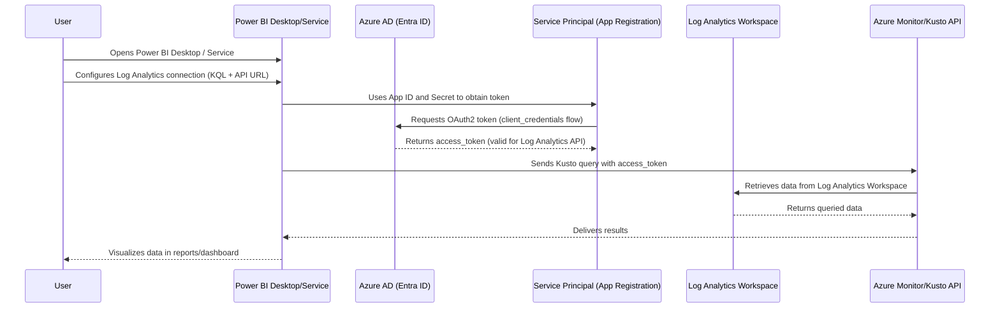
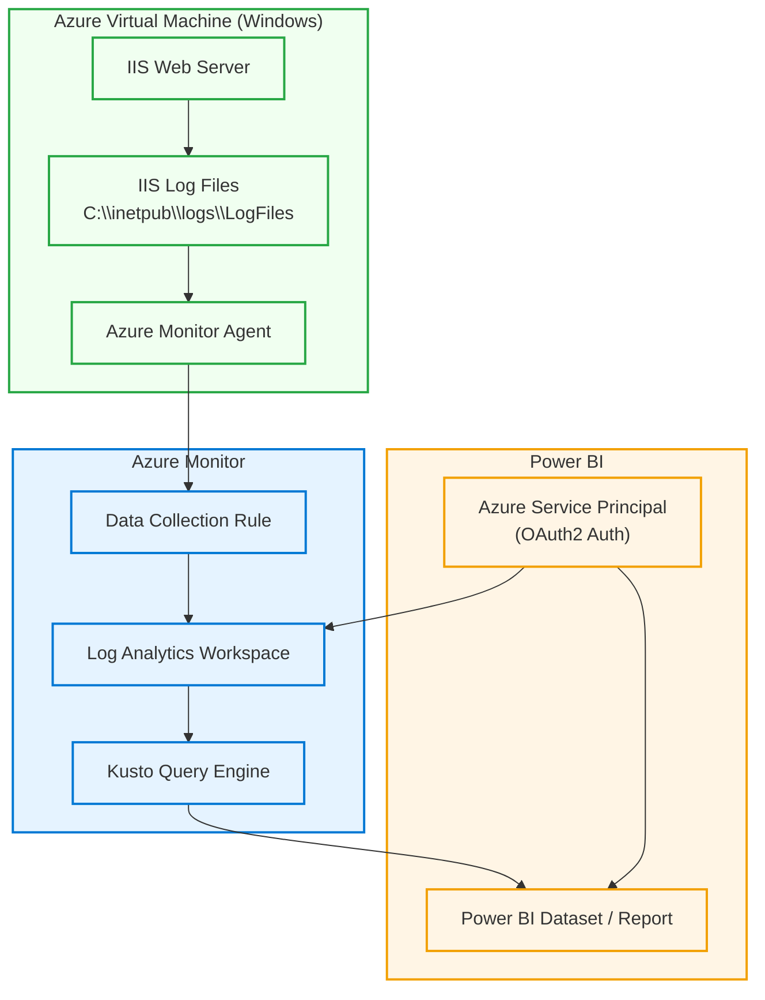
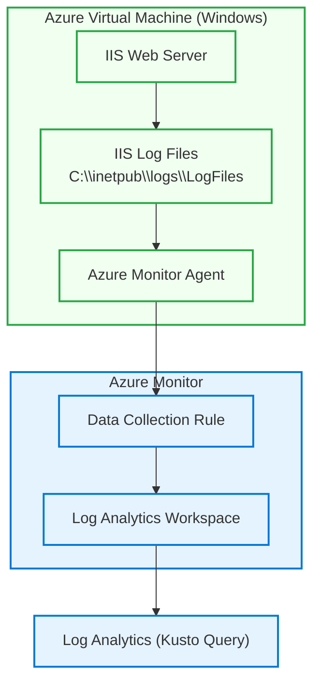
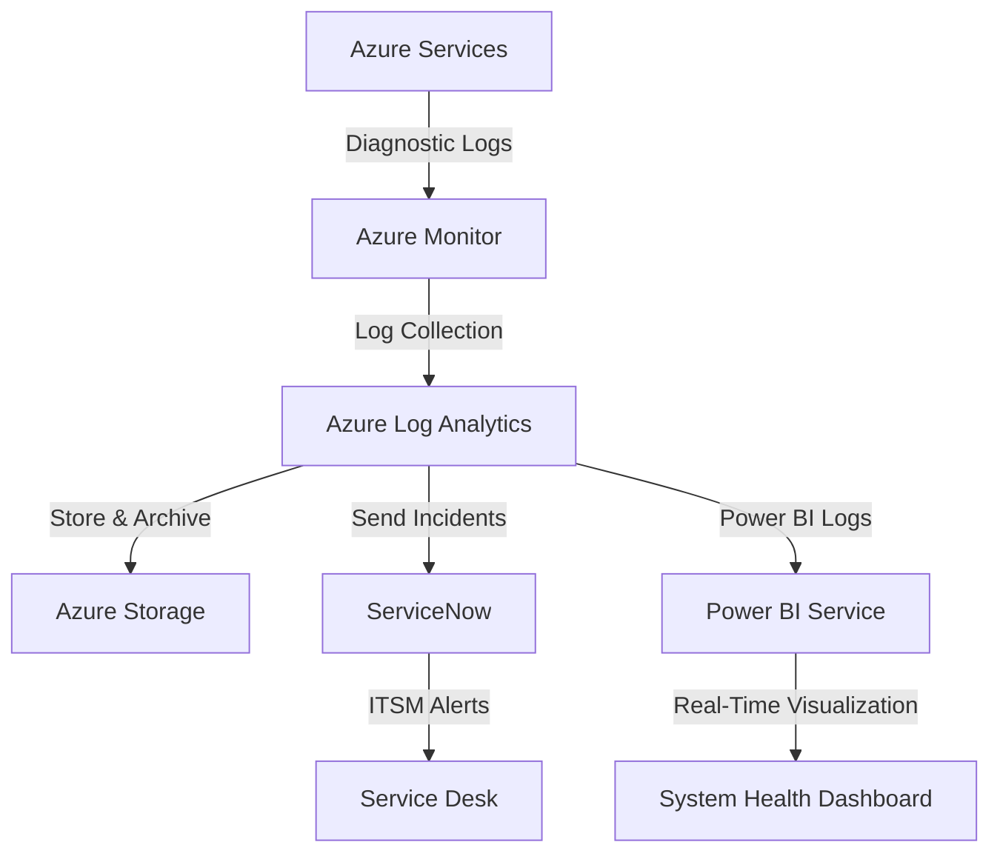
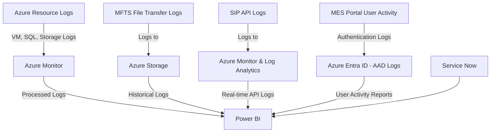
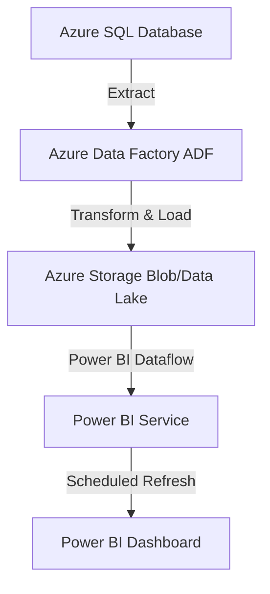
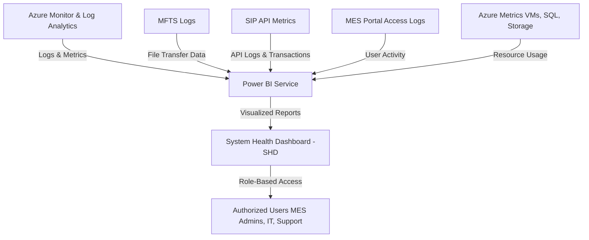

To calculate **daily transaction volume** in Power BI using DAX, you can use the following query. This assumes you have a date/time column such as `Timestamp` and a transaction identifier like `RequestID`.

---

### ✅ DAX Query: Daily Transaction Volume

```dax
DailyTransactionVolume :=
SUMMARIZE(
    'YourTableName',
    CALCULATETABLE(
        VALUES('YourTableName'[Date]), 
        NOT(ISBLANK('YourTableName'[RequestID]))
    ),
    "TransactionDate", 
        FORMAT('YourTableName'[Timestamp], "yyyy-MM-dd"),
    "TransactionCount", 
        COUNT('YourTableName'[RequestID])
)
```

---

### 💡 Simplified Version with `ADDCOLUMNS` (Better for some visuals)

```dax
DailyTransactionVolume :=
ADDCOLUMNS(
    SUMMARIZE(
        'YourTableName',
        FORMAT('YourTableName'[Timestamp], "yyyy-MM-dd")
    ),
    "TransactionCount",
        CALCULATE(COUNT('YourTableName'[RequestID]))
)
```

> Replace `'YourTableName'` with your actual table name (e.g., `API_Responses` or `AuditLogs`).

---

### 📊 Usage:

* Use this measure/table to feed a **line chart** or **bar chart** for visualizing daily volume.
* You can also extend this to group by endpoint or status by adding additional columns in `SUMMARIZE`.

Let me know if you want this adapted for specific filters like `"Status" = '200 OK'` or to compare across APIs!

To add an alias while filtering and still return a clean summary, you can use a calculated column or better yet, create a DAX query using `ADDCOLUMNS` and `SWITCH` to map `AuditEventType` to a user-friendly alias.

---

### ✅ DAX Query with Aliases for `AuditEventType`

```dax
AuditEventSummaryWithAlias :=
SUMMARIZE(
    FILTER(
        'AuditLogs',
        'AuditLogs'[AuditEventType] IN {"Error", "Delivery"}
    ),
    'AuditLogs'[AuditEventType],
    "EventAlias",
        SWITCH(
            'AuditLogs'[AuditEventType],
            "Error", "❌ Error Event",
            "Delivery", "📦 Delivery Event",
            "Other"
        ),
    "EventCount", COUNTROWS('AuditLogs')
)
```

---

### 🧾 What This Does:

* `SWITCH`: Provides a friendly alias for each event type.
* `EventAlias`: A column alias shown in visuals like a table or chart.
* `EventCount`: The number of rows for each `AuditEventType`.

---

### 🔁 Alternate version using `ADDCOLUMNS`

If you're building this for use in a visual directly:

```dax
AuditEventSummaryWithAlias :=
ADDCOLUMNS(
    SUMMARIZE(
        FILTER('AuditLogs', 'AuditLogs'[AuditEventType] IN {"Error", "Delivery"}),
        'AuditLogs'[AuditEventType]
    ),
    "EventAlias",
        SWITCH(
            'AuditLogs'[AuditEventType],
            "Error", "❌ Error Event",
            "Delivery", "📦 Delivery Event",
            "Other"
        ),
    "EventCount", COUNTROWS(FILTER('AuditLogs', 'AuditLogs'[AuditEventType] = EARLIER('AuditLogs'[AuditEventType])))
)
```

Let me know if you'd like to visualize this in a matrix or combine with time dimensions!

Here’s a DAX query you can use in **Power BI** to compare `AuditEventType` values — specifically `Error` vs `Delivery` — in a summary table or visual.

### ✅ DAX Query: Count of Audit Events by Type (Error vs Delivery)

```dax
AuditEventSummary :=
SUMMARIZE(
    FILTER(
        'AuditLogs',
        'AuditLogs'[AuditEventType] IN {"Error", "Delivery"}
    ),
    'AuditLogs'[AuditEventType],
    "EventCount", COUNTROWS('AuditLogs')
)
```

### 🔍 Explanation:

* `FILTER`: Restricts the dataset to only include `Error` and `Delivery` event types.
* `SUMMARIZE`: Groups the result by `AuditEventType`.
* `COUNTROWS`: Counts how many records exist for each type.

---

### 📈 Optional Variant for a Visual with Date

If you want to view the counts over time (e.g., by day):

```dax
AuditEventTrend :=
SUMMARIZE(
    FILTER(
        'AuditLogs',
        'AuditLogs'[AuditEventType] IN {"Error", "Delivery"}
    ),
    'AuditLogs'[Date],
    'AuditLogs'[AuditEventType],
    "EventCount", COUNTROWS('AuditLogs')
)
```

This will allow you to build a **line or clustered column chart** comparing `Error` vs `Delivery` over time.

Let me know if you’d like this wrapped in a calculated table or visual measure!


# Powerbi-Reporting

Here's a **detailed Mermaid sequence diagram** illustrating how **Power BI connects to an Azure Log Analytics Workspace using a Service Principal for authentication**:

---

### ✅ **Key Components in the Sequence**:

* **User**: Analyst or report creator.
* **Power BI Desktop/Service**: Tool used for data modeling and visualization.
* **Azure AD (Entra ID)**: Authenticates the service principal.
* **Service Principal (App Registration)**: Provides app-level access to Log Analytics.
* **Log Analytics Workspace (LAW)**: Target data source.
* **Kusto REST API / Azure Monitor API**: Interface used to query data from LAW.

---

### ✅ **Mermaid Sequence Diagram**



---

### 🔐 **Authentication Flow (Service Principal)**

* **Flow**: OAuth2.0 - Client Credentials
* **Token Endpoint**:
  `https://login.microsoftonline.com/{tenant-id}/oauth2/v2.0/token`
* **Required Permissions**:
  `Azure Monitor > Data.Read` or `Log Analytics Reader` on the LAW.

---

### ⚙️ **Power BI Connection Settings**

When connecting from Power BI:

* Use the **Azure Monitor** or **Kusto** connector.
* Choose **"Organizational Account"** and inject the **token manually** in advanced scenarios via custom connectors or gateway.

---

Would you like me to generate this sequence diagram as a PNG or include setup steps in Power BI and Azure for this connection?


Here’s a **design diagram** showing how **IIS logs from an Azure VM** are collected using **Azure Monitor Agent (AMA)** and **Data Collection Rules (DCRs)**, then ingested into **Log Analytics Workspace** for querying.

---
Here’s the **expanded Mermaid architecture diagram** that includes **Power BI** connecting to **Log Analytics Workspace** using an **Azure Service Principal** for authentication. This is useful for enabling **automated dashboards** based on IIS logs collected from Azure VMs.

---

### **🖼️ Expanded Mermaid Diagram – IIS Logs to Power BI via Azure Monitor**



---

### 🔍 Component Notes

| Component                         | Description                                                |
| --------------------------------- | ---------------------------------------------------------- |
| **Azure Monitor Agent (AMA)**     | Collects IIS logs from the VM                              |
| **DCR (Data Collection Rule)**    | Configured with file path to IIS logs                      |
| **Log Analytics Workspace (LAW)** | Stores collected data                                      |
| **Kusto Query Engine (KQL)**      | Used to query the data (e.g., custom dashboards)           |
| **Azure Service Principal (SPN)** | Authenticates Power BI to access Log Analytics             |
| **Power BI**                      | Pulls data from LAW using KQL queries via SPN              |
| **Power BI Dataset/Report**       | Visualizes metrics such as request count, error rate, etc. |

---

### ✅ Key Integration Steps for Power BI Access

1. **Register an App (SPN)** in **Azure Entra ID**.
2. Grant the **SPN** **Reader** access to **Log Analytics Workspace**.
3. Assign **Log Analytics Reader** role to the SPN (or custom role with `Microsoft.OperationalInsights/workspaces/query/*`).
4. Use **Power BI Desktop** → **Get Data** → **Azure Log Analytics (Beta)**.
5. Use the **SPN credentials** via Azure Active Directory OAuth2 to authenticate.
6. Write and run **KQL queries** to build datasets.

---

Would you like a **Power BI KQL query** sample to visualize **IIS request volumes or error rates** over time?

### **Mermaid Diagram – IIS Log Collection via Azure Monitor DCR**



---

### 📘 **Component Descriptions**

| Component                         | Description                                                          |
| --------------------------------- | -------------------------------------------------------------------- |
| **IIS**                           | Web server hosting applications, generating logs (e.g., `u_ex*.log`) |
| **IIS Log Files**                 | Default log location: `C:\inetpub\logs\LogFiles\W3SVC1`              |
| **Azure Monitor Agent (AMA)**     | Installed on the VM, reads IIS logs as per DCR path                  |
| **Data Collection Rule (DCR)**    | Defines log source path and destination (e.g., Log Analytics)        |
| **Log Analytics Workspace (LAW)** | Centralized Azure Monitor data store where logs are sent             |
| **Log Analytics (Kusto Query)**   | Use KQL to query and visualize collected log data                    |

---

Would you like a **Bicep, Terraform, or YAML** example to implement this setup end-to-end?


To collect **IIS logs** from an **Azure Virtual Machine (VM)** using **Azure Monitor** with a **Data Collection Rule (DCR)**, follow these structured steps:

---

### ✅ Prerequisites

1. **Azure VM** (Windows) with IIS installed and logging enabled.
2. **Azure Monitor Agent (AMA)** installed on the VM.
3. **Log Analytics Workspace** to send the logs.
4. **Permissions**: You must have at least **Monitoring Contributor** or **Contributor** role on the VM and Log Analytics Workspace.

---

### 🔁 High-Level Workflow

1. Enable IIS logging on the VM.
2. Install Azure Monitor Agent (AMA).
3. Create a Data Collection Rule (DCR).
4. Configure the IIS log collection path.
5. Associate the DCR to the VM.
6. Validate data in Log Analytics.

---

### 🛠 Step-by-Step Instructions

---

#### 🔹 Step 1: Enable IIS Logging on VM

1. Connect to your VM using RDP.
2. Open **IIS Manager** → Select your site (e.g., Default Web Site).
3. In the **Features View**, double-click **Logging**.
4. Make sure logging is enabled and the **log file directory path** is noted (default: `C:\inetpub\logs\LogFiles`).

---

#### 🔹 Step 2: Install Azure Monitor Agent

1. In Azure Portal, go to **Virtual Machines**.
2. Select the VM → In the left menu, go to **Extensions + applications**.
3. Click **+ Add** → Choose **Azure Monitor Agent** → Install.

Alternatively, use PowerShell:

```powershell
az vm extension set --resource-group <ResourceGroup> --vm-name <VMName> `
--name AzureMonitorWindowsAgent --publisher Microsoft.Azure.Monitor
```

---

#### 🔹 Step 3: Create a Log Analytics Workspace (if not already done)

```bash
az monitor log-analytics workspace create \
  --resource-group <ResourceGroup> \
  --workspace-name <WorkspaceName> \
  --location <Region>
```

---

#### 🔹 Step 4: Create a Data Collection Rule (DCR)

You can do this from the **Azure Portal** or use CLI. Here is a portal-based flow:

1. Go to **Azure Monitor** → **Data Collection Rules** → **+ Create**.

2. **Basics**:

   * Subscription & Resource Group
   * DCR Name (e.g., `iis-log-dcr`)
   * Region (same as VM)

3. **Resources to collect from**:

   * Click **+ Add resource**
   * Select your **Windows VM**

4. **Data Sources**:

   * Choose **Custom Logs**
   * File path:

     ```
     C:\inetpub\logs\LogFiles\W3SVC1\u_ex*.log
     ```
   * Record delimiter: **New line**

5. **Destination**:

   * Send to **Log Analytics Workspace**
   * Select your workspace

6. Review and create

---

#### 🔹 Step 5: Associate DCR with VM

This is already done in step 4 during creation if you selected the VM.

If needed later:

```bash
az monitor data-collection rule association create \
  --name <association-name> \
  --rule-name <dcr-name> \
  --resource <vm-resource-id> \
  --resource-type "Microsoft.Compute/virtualMachines" \
  --resource-group <ResourceGroup>
```

---

#### 🔹 Step 6: Validate Logs in Log Analytics

1. Go to **Log Analytics Workspace** → **Logs**.
2. Use the following KQL query:

```kusto
CustomLog_CL
| where _ResourceId contains "<VMName>" 
| sort by TimeGenerated desc
```

Replace `CustomLog_CL` with the actual table name if you specified a custom name during DCR setup.

---

### 🧠 Notes

* Azure Monitor Agent uses **Data Collection Rules (DCRs)** to define exactly **what data to collect and where to send it**.
* IIS logs are treated as **custom logs** collected via a **path-based pattern**.
* Each IIS site might log to a different folder (e.g., `W3SVC2`, `W3SVC3`) — include all needed paths.

---

Would you like a **Terraform or ARM template** to automate this setup?


Here’s a **DAX query** that creates a **burn down table** for displaying **open vs closed incidents over time** in a **stacked column chart** in Power BI.

This is ideal for visualizing how your **open backlog decreases** (or grows) day-by-day as incidents are **opened and closed**.

---

### ✅ DAX Table: `Incident_Burndown_ByDate`

```dax
Incident_Burndown_ByDate =
VAR MinDate = CALCULATE(MIN('Incidents'[OpenedAt]), NOT(ISBLANK('Incidents'[OpenedAt])))
VAR MaxDate = CALCULATE(
    MAXX('Incidents', COALESCE('Incidents'[ClosedAt], TODAY()))
)

-- Step 1: Create continuous date range
VAR DateRange =
    ADDCOLUMNS (
        CALENDAR ( MinDate, MaxDate ),
        "Date", [Date]
    )

-- Step 2: Add counts of opened, closed, and open on each day
RETURN
ADDCOLUMNS (
    DateRange,
    "OpenedCount",
        CALCULATE (
            COUNTROWS ( 'Incidents' ),
            FILTER (
                'Incidents',
                NOT(ISBLANK('Incidents'[OpenedAt])) &&
                'Incidents'[OpenedAt] = [Date]
            )
        ),
    "ClosedCount",
        CALCULATE (
            COUNTROWS ( 'Incidents' ),
            FILTER (
                'Incidents',
                NOT(ISBLANK('Incidents'[ClosedAt])) &&
                'Incidents'[ClosedAt] = [Date]
            )
        ),
    "OpenRunningTotal",
        CALCULATE (
            COUNTROWS ( 'Incidents' ),
            FILTER (
                'Incidents',
                NOT(ISBLANK('Incidents'[OpenedAt])) &&
                'Incidents'[OpenedAt] <= [Date] &&
                (
                    ISBLANK('Incidents'[ClosedAt]) ||
                    'Incidents'[ClosedAt] > [Date]
                )
            )
        )
)
```

---

### 🧾 Output Columns

| Column             | Description                                         |
| ------------------ | --------------------------------------------------- |
| `Date`             | Day in timeline                                     |
| `OpenedCount`      | Number of incidents opened on that day              |
| `ClosedCount`      | Number of incidents closed on that day              |
| `OpenRunningTotal` | Total number of incidents still open as of that day |

---

### 📊 Power BI Chart Configuration

#### 🟦 **Stacked Column Chart** (Burn Down View)

| Axis   | `Date`                                            |
| ------ | ------------------------------------------------- |
| Values | `OpenedCount`, `ClosedCount`                      |
| Legend | Use `Field value` or `hardcoded color categories` |

#### 📈 **Optional Line Overlay**

* Add a **Line and Stacked Column Chart**
* Line value: `OpenRunningTotal`

This way you show:

* 📊 Daily open and closed activity (columns)
* 📉 Cumulative open backlog over time (line)

---

Would you like this wrapped into a **measure-based version** or a **sample PBIX with slicers for Assignment Group or Priority**?


Sure! Below are **two different DAX queries** for generating an `Incident_AgeBuckets_Summary` table in Power BI. Both categorize incidents into **age buckets**, but use different methods:

---

## ✅ Query 1: **Using DATEDIFF Bucketing with Status Split (Open vs Closed)**

This query uses `DATEDIFF` to classify incidents into age buckets and splits them into **open vs closed** counts.

```dax
Incident_AgeBuckets_Summary_1 =
VAR TodayDate = TODAY()
RETURN
SUMMARIZE (
    'Incidents',
    -- Age Bucket based on days between OpenedAt and either ClosedAt or Today
    SWITCH (
        TRUE(),
        ISBLANK('Incidents'[ClosedAt]) &&
        DATEDIFF('Incidents'[OpenedAt], TodayDate, DAY) <= 7, "Open: 0-7 Days",
        ISBLANK('Incidents'[ClosedAt]) &&
        DATEDIFF('Incidents'[OpenedAt], TodayDate, DAY) <= 14, "Open: 8-14 Days",
        ISBLANK('Incidents'[ClosedAt]) &&
        DATEDIFF('Incidents'[OpenedAt], TodayDate, DAY) <= 30, "Open: 15-30 Days",
        ISBLANK('Incidents'[ClosedAt]) &&
        DATEDIFF('Incidents'[OpenedAt], TodayDate, DAY) > 30, "Open: >30 Days",
        NOT(ISBLANK('Incidents'[ClosedAt])) &&
        DATEDIFF('Incidents'[OpenedAt], 'Incidents'[ClosedAt], DAY) <= 7, "Closed: 0-7 Days",
        NOT(ISBLANK('Incidents'[ClosedAt])) &&
        DATEDIFF('Incidents'[OpenedAt], 'Incidents'[ClosedAt], DAY) <= 14, "Closed: 8-14 Days",
        NOT(ISBLANK('Incidents'[ClosedAt])) &&
        DATEDIFF('Incidents'[OpenedAt], 'Incidents'[ClosedAt], DAY) <= 30, "Closed: 15-30 Days",
        "Closed: >30 Days"
    ) AS AgeBucket,
    "IncidentCount", COUNTROWS('Incidents')
)
```

---

## ✅ Query 2: **Using Bucket Range from a Custom Column + Status Filter**

This query assumes you've already created a calculated column called `AgeInDays` and `Status` (Open/Closed), and groups by **explicit numeric ranges**.

### Example supporting calculated column:

```dax
AgeInDays = 
DATEDIFF(
    'Incidents'[OpenedAt],
    COALESCE('Incidents'[ClosedAt], TODAY()),
    DAY
)
```

### Query:

```dax
Incident_AgeBuckets_Summary_2 =
SUMMARIZE (
    'Incidents',
    SWITCH (
        TRUE(),
        'Incidents'[AgeInDays] <= 7, "0-7 Days",
        'Incidents'[AgeInDays] <= 14, "8-14 Days",
        'Incidents'[AgeInDays] <= 30, "15-30 Days",
        "30+ Days"
    ) AS AgeBucket,
    'Incidents'[Status],
    "IncidentCount", COUNTROWS('Incidents')
)
```

---

### 📊 Use Cases

| Query Type | Use Case                                                               |
| ---------- | ---------------------------------------------------------------------- |
| Query 1    | When no Age column exists and you want to bucket dynamically by status |
| Query 2    | When you want flexibility or have a model with precomputed age/status  |

---

Would you like a version that includes **SLA compliance** or groups incidents by **assignment group or category** as a second axis?


Here’s a **DAX query** that creates a **table comparing Incident Age Buckets** with the **number of open and closed incidents** — perfect for visualizing in **matrix** or **stacked column charts** in Power BI.

---

### ✅ DAX Table: `Incident_AgeBuckets_Summary`

```dax
Incident_AgeBuckets_Summary =
VAR TodayDate = TODAY()

-- Build age buckets
RETURN
SUMMARIZECOLUMNS (
    SWITCH (
        TRUE(),
        ISBLANK('Incidents'[ClosedAt]) &&
        DATEDIFF('Incidents'[OpenedAt], TodayDate, DAY) <= 7, "AgeBucket", "0-7 Days",
        
        ISBLANK('Incidents'[ClosedAt]) &&
        DATEDIFF('Incidents'[OpenedAt], TodayDate, DAY) <= 14, "AgeBucket", "8-14 Days",
        
        ISBLANK('Incidents'[ClosedAt]) &&
        DATEDIFF('Incidents'[OpenedAt], TodayDate, DAY) <= 30, "AgeBucket", "15-30 Days",
        
        ISBLANK('Incidents'[ClosedAt]) &&
        DATEDIFF('Incidents'[OpenedAt], TodayDate, DAY) > 30, "AgeBucket", "30+ Days",

        NOT(ISBLANK('Incidents'[ClosedAt])) &&
        DATEDIFF('Incidents'[OpenedAt], 'Incidents'[ClosedAt], DAY) <= 7, "AgeBucket", "Closed in 0-7 Days",

        NOT(ISBLANK('Incidents'[ClosedAt])) &&
        DATEDIFF('Incidents'[OpenedAt], 'Incidents'[ClosedAt], DAY) <= 14, "AgeBucket", "Closed in 8-14 Days",

        NOT(ISBLANK('Incidents'[ClosedAt])) &&
        DATEDIFF('Incidents'[OpenedAt], 'Incidents'[ClosedAt], DAY) <= 30, "AgeBucket", "Closed in 15-30 Days",

        "Closed in 30+ Days"  -- default
    ),
    "OpenIncidents",
        CALCULATE (
            COUNTROWS ( 'Incidents' ),
            'Incidents'[ClosedAt] = BLANK()
        ),
    "ClosedIncidents",
        CALCULATE (
            COUNTROWS ( 'Incidents' ),
            NOT(ISBLANK('Incidents'[ClosedAt]))
        )
)
```

---

### 🧾 What This Table Contains

| Column            | Description                                               |
| ----------------- | --------------------------------------------------------- |
| `AgeBucket`       | Bucketed by time to close (if closed) or age (if open)    |
| `OpenIncidents`   | Count of currently open incidents in that age bucket      |
| `ClosedIncidents` | Count of closed incidents falling in that duration bucket |

---

### 📊 Chart Suggestions

* **Matrix** with `AgeBucket` rows, `OpenIncidents` and `ClosedIncidents` as values
* **Stacked Column Chart**:

  * Axis: `AgeBucket`
  * Values: `OpenIncidents`, `ClosedIncidents`

---

### 💡 Pro Tip

To control bucket ordering, create a **separate Age Bucket table** with an index column and use it as a dimension with a sort-by column.

Would you like the companion **Age Bucket dimension table** and DAX to relate it properly?

Here’s a full **DAX query** that gives you a **daily breakdown of open and closed incidents**, along with **age buckets** and incident counts grouped by bucket.

This structure allows you to:

* Plot **daily trends** of open/closed incidents
* Compare **incident age distribution over time**
* Use it in line charts, stacked columns, or matrix visuals

---

### ✅ DAX Table: `DailyIncidentAgeBuckets`

```dax
DailyIncidentAgeBuckets =
VAR TodayDate = TODAY()

-- Build a list of relevant dates
VAR DateTable =
    ADDCOLUMNS (
        CALENDAR (
            MINX ( 'Incidents', 'Incidents'[OpenedAt] ),
            MAXX ( 'Incidents', COALESCE('Incidents'[ClosedAt], TODAY()) )
        ),
        "Date", [Date]
    )

-- Return final summarized table
RETURN
ADDCOLUMNS (
    DateTable,
    "OpenCount",
        CALCULATE (
            COUNTROWS ( 'Incidents' ),
            FILTER (
                'Incidents',
                'Incidents'[OpenedAt] <= [Date]
                    && (
                        ISBLANK('Incidents'[ClosedAt])
                        || 'Incidents'[ClosedAt] > [Date]
                    )
            )
        ),
    "ClosedCount",
        CALCULATE (
            COUNTROWS ( 'Incidents' ),
            FILTER (
                'Incidents',
                NOT(ISBLANK('Incidents'[ClosedAt]))
                    && 'Incidents'[ClosedAt] = [Date]
            )
        ),
    "AgeBucket",
        SWITCH (
            TRUE(),
            -- For open incidents, calculate age as of [Date]
            CALCULATE (
                COUNTROWS ( 'Incidents' ),
                FILTER (
                    'Incidents',
                    'Incidents'[OpenedAt] <= [Date]
                        && ISBLANK('Incidents'[ClosedAt])
                        && DATEDIFF('Incidents'[OpenedAt], [Date], DAY) <= 7
                )
            ) > 0, "Open: 0–7 Days",

            CALCULATE (
                COUNTROWS ( 'Incidents' ),
                FILTER (
                    'Incidents',
                    'Incidents'[OpenedAt] <= [Date]
                        && ISBLANK('Incidents'[ClosedAt])
                        && DATEDIFF('Incidents'[OpenedAt], [Date], DAY) <= 14
                        && DATEDIFF('Incidents'[OpenedAt], [Date], DAY) > 7
                )
            ) > 0, "Open: 8–14 Days",

            CALCULATE (
                COUNTROWS ( 'Incidents' ),
                FILTER (
                    'Incidents',
                    'Incidents'[OpenedAt] <= [Date]
                        && ISBLANK('Incidents'[ClosedAt])
                        && DATEDIFF('Incidents'[OpenedAt], [Date], DAY) <= 30
                        && DATEDIFF('Incidents'[OpenedAt], [Date], DAY) > 14
                )
            ) > 0, "Open: 15–30 Days",

            CALCULATE (
                COUNTROWS ( 'Incidents' ),
                FILTER (
                    'Incidents',
                    'Incidents'[OpenedAt] <= [Date]
                        && ISBLANK('Incidents'[ClosedAt])
                        && DATEDIFF('Incidents'[OpenedAt], [Date], DAY) > 30
                )
            ) > 0, "Open: >30 Days",

            "Closed or N/A"
        )
)
```

---

### 🧾 Output Fields

| Column        | Description                                         |
| ------------- | --------------------------------------------------- |
| `Date`        | Calendar date in the range of incidents             |
| `OpenCount`   | How many incidents were open as of that date        |
| `ClosedCount` | How many incidents were closed on that date         |
| `AgeBucket`   | Classification of open incidents by age on that day |

---

### 📊 Chart Suggestions

1. **Line Chart**:

   * X: `Date`
   * Y: `OpenCount` and `ClosedCount` (2 lines)
2. **Stacked Area Chart**:

   * X: `Date`
   * Y: `OpenCount`
   * Legend: `AgeBucket`
3. **Matrix**:

   * Rows: `AgeBucket`
   * Columns: `Date` (day/week/month)
   * Values: `OpenCount` or `ClosedCount`

---

Would you like this converted into a Power BI **dataflow**, or a **sample dataset** for testing with a `.pbix` file?

Perfect — here’s a complete **DAX query** to create a **time series table** that tracks:

```python

import pandas as pd
import matplotlib.pyplot as plt
import numpy as np
from datetime import timedelta

# Sample data generation
np.random.seed(42)
start_date = pd.to_datetime("2024-01-01")
end_date = pd.to_datetime("2024-01-30")
date_range = pd.date_range(start=start_date, end=end_date, freq='D')

# Simulate open and close activity
opened_count = np.random.poisson(3, len(date_range))
closed_count = np.random.poisson(2, len(date_range))

# Simulate running total
open_running_total = np.cumsum(opened_count - closed_count)
open_running_total = np.clip(open_running_total, 0, None)

# Simulate ClosedWithinSLA as a portion of closed_count
closed_within_sla = np.minimum(closed_count, np.random.poisson(1, len(date_range)))

# Build DataFrame
df = pd.DataFrame({
    'Date': date_range,
    'OpenedCount': opened_count,
    'ClosedCount': closed_count,
    'OpenRunningTotal': open_running_total,
    'ClosedWithinSLA': closed_within_sla
})

# Plotting
plt.figure(figsize=(14, 6))

# Lines for running total and daily open/close
plt.plot(df['Date'], df['OpenRunningTotal'], label='Open Running Total', linewidth=2)
plt.plot(df['Date'], df['OpenedCount'], label='Opened Count (Daily)', linestyle='--')
plt.plot(df['Date'], df['ClosedCount'], label='Closed Count (Daily)', linestyle='--')

# Bars for SLA
plt.bar(df['Date'], df['ClosedWithinSLA'], label='Closed Within SLA (≤7d)', color='lightgreen', alpha=0.5)

plt.title("Critical Change Requests - Time Series (Opened vs Closed vs SLA)", fontsize=14)
plt.xlabel("Date")
plt.ylabel("Count")
plt.legend()
plt.grid(True)
plt.tight_layout()
plt.xticks(rotation=45)
plt.show()

```
Here's a sample time series chart showing:

* 📈 **Open Running Total** (cumulative active Critical CRs)
* 🔹 **Daily Opened and Closed** counts (dashed lines)
* 🟩 **Closed Within SLA (≤7 days)** as semi-transparent bars

This is ideal for use in a Power BI line and column combo chart for burndown and SLA tracking.

Would you like the underlying sample dataset exported as CSV?


Here's a sample time series chart showing:

* 📈 **Open Running Total** (cumulative active Critical CRs)
* 🔹 **Daily Opened and Closed** counts (dashed lines)
* 🟩 **Closed Within SLA (≤7 days)** as semi-transparent bars

This is ideal for use in a Power BI line and column combo chart for burndown and SLA tracking.

Would you like the underlying sample dataset exported as CSV?


* **Daily** status of **Critical Change Requests**
* Counts of **opened** and **closed** per day
* A **running total of open requests** (burndown style)
* Tracking over a **continuous time series**, even on days with zero activity

---

### ✅ Final DAX Table: `CriticalCR_TimeSeriesTracking`

```dax
CriticalCR_TimeSeriesTracking =
VAR CriticalCRs =
    FILTER (
        'Requests',
        LOWER('Requests'[Priority]) = "critical"
            && LOWER('Requests'[Type]) = "change request"
            && NOT(ISBLANK('Requests'[OpenedAt]))
    )

-- Create a continuous date series from earliest opened to latest closed or today
VAR DateRange =
    CALENDAR (
        MINX(CriticalCRs, 'Requests'[OpenedAt]),
        MAXX(CriticalCRs, COALESCE('Requests'[ClosedAt], TODAY()))
    )

-- Add columns: Opened, Closed, OpenRunningTotal, ClosedWithinSLA
RETURN
ADDCOLUMNS (
    DateRange,
    "OpenedCount",
        CALCULATE (
            COUNTROWS ( CriticalCRs ),
            FILTER (
                CriticalCRs,
                'Requests'[OpenedAt] = [Date]
            )
        ),
    "ClosedCount",
        CALCULATE (
            COUNTROWS ( CriticalCRs ),
            FILTER (
                CriticalCRs,
                NOT(ISBLANK('Requests'[ClosedAt]))
                && 'Requests'[ClosedAt] = [Date]
            )
        ),
    "OpenRunningTotal",
        CALCULATE (
            COUNTROWS ( CriticalCRs ),
            FILTER (
                CriticalCRs,
                'Requests'[OpenedAt] <= [Date]
                && (
                    ISBLANK('Requests'[ClosedAt])
                    || 'Requests'[ClosedAt] > [Date]
                )
            )
        ),
    "ClosedWithinSLA",
        CALCULATE (
            COUNTROWS ( CriticalCRs ),
            FILTER (
                CriticalCRs,
                NOT(ISBLANK('Requests'[ClosedAt]))
                && 'Requests'[ClosedAt] = [Date]
                && DATEDIFF('Requests'[OpenedAt], 'Requests'[ClosedAt], DAY) <= 7
            )
        )
)
```

---

### 📊 Output Columns (Time Series)

| Column             | Description                                                               |
| ------------------ | ------------------------------------------------------------------------- |
| `Date`             | Each day in the time range                                                |
| `OpenedCount`      | How many Critical CRs were opened on that date                            |
| `ClosedCount`      | How many Critical CRs were closed on that date                            |
| `OpenRunningTotal` | Cumulative count of CRs still open as of that date                        |
| `ClosedWithinSLA`  | How many CRs were closed that day within SLA (≤7 days from open to close) |

---

### 📈 Recommended Line Chart Setup

* **X-Axis**: `Date`
* **Y-Axis (Lines)**:

  * `OpenRunningTotal` – Active open CRs (shows burndown)
  * `OpenedCount` and `ClosedCount` – Trends of activity
  * Optional: `ClosedWithinSLA` as shaded area or separate column series

---

Would you like this version enhanced to include **filters by Assignment Group, Region, or Time Slicer Sync** for drill-through dashboards?

Great! Below is an **enhanced cumulative DAX query** that:

* Tracks **Critical Change Requests** over time
* Shows **cumulative opened vs. closed**
* Groups the results by **month and year** for trend analysis
* Optionally highlights **SLA threshold** (e.g., close within 7 days)

---

### ✅ DAX Table: `CriticalCR_CumulativeMonthlyTrend`

```dax
CriticalCR_CumulativeMonthlyTrend =
VAR CriticalCRs =
    FILTER (
        'Requests',
        LOWER('Requests'[Priority]) = "critical"
            && LOWER('Requests'[Type]) = "change request"
            && NOT(ISBLANK('Requests'[OpenedAt]))
    )

VAR DateRange =
    CALENDAR(
        MINX(CriticalCRs, 'Requests'[OpenedAt]),
        MAXX(CriticalCRs, COALESCE('Requests'[ClosedAt], TODAY()))
    )

VAR WithPeriod =
    ADDCOLUMNS(
        DateRange,
        "Year", YEAR([Date]),
        "Month", FORMAT([Date], "MMM"),
        "YearMonth", FORMAT([Date], "YYYY-MM")
    )

RETURN
SUMMARIZECOLUMNS(
    'WithPeriod'[YearMonth],
    'WithPeriod'[Year],
    'WithPeriod'[Month],
    "CumulativeOpened",
        CALCULATE(
            COUNTROWS(CriticalCRs),
            FILTER(
                CriticalCRs,
                'Requests'[OpenedAt] <= MAX('WithPeriod'[Date])
            )
        ),
    "CumulativeClosed",
        CALCULATE(
            COUNTROWS(CriticalCRs),
            FILTER(
                CriticalCRs,
                NOT(ISBLANK('Requests'[ClosedAt])) &&
                'Requests'[ClosedAt] <= MAX('WithPeriod'[Date])
            )
        ),
    "ClosedWithinSLA",
        CALCULATE(
            COUNTROWS(CriticalCRs),
            FILTER(
                CriticalCRs,
                NOT(ISBLANK('Requests'[ClosedAt])) &&
                DATEDIFF('Requests'[OpenedAt], 'Requests'[ClosedAt], DAY) <= 7 &&
                'Requests'[ClosedAt] <= MAX('WithPeriod'[Date])
            )
        )
)
```

---

### 📈 Chart Recommendations

| Metric             | Use In Chart Type         | Description                             |
| ------------------ | ------------------------- | --------------------------------------- |
| `CumulativeOpened` | Line                      | Total opened Critical CRs over time     |
| `CumulativeClosed` | Line                      | Total closed Critical CRs over time     |
| `ClosedWithinSLA`  | Column or area under line | SLA performance trend (<= 7 days close) |

#### Line Chart Configuration

* **X-axis**: `YearMonth` (sort by Year + Month index)
* **Y-axis**: CumulativeOpened, CumulativeClosed (lines), ClosedWithinSLA (optional fill area or bars)

---

### 🧠 Bonus Tips

* To sort `Month` properly in visuals, create a `MonthNumber` column:

  ```dax
  MonthNumber = MONTH([Date])
  ```
* To support slicers or filters, consider using a separate **Date Dimension** table.

---

Would you like this wrapped into a reusable **Power BI Dataflow or a .pbix demo file**?


Here’s a **cumulative DAX query** that produces a table suitable for a **line chart in Power BI**, comparing the **cumulative count of Critical Change Requests opened vs closed** over time.

This will enable a **line chart with two series**:

* **Cumulative Opened**
* **Cumulative Closed**

---

### ✅ DAX Table: `CriticalCR_CumulativeOpenClosed`

```dax
CriticalCR_CumulativeOpenClosed =
VAR CriticalCRs =
    FILTER (
        'Requests',
        LOWER('Requests'[Priority]) = "critical"
            && LOWER('Requests'[Type]) = "change request"
            && NOT(ISBLANK('Requests'[OpenedAt]))
    )

VAR Dates =
    CALENDAR(
        MINX(CriticalCRs, 'Requests'[OpenedAt]),
        MAXX(CriticalCRs, COALESCE('Requests'[ClosedAt], TODAY()))
    )

RETURN
ADDCOLUMNS(
    Dates,
    "CumulativeOpened",
        CALCULATE(
            COUNTROWS(CriticalCRs),
            FILTER(
                CriticalCRs,
                'Requests'[OpenedAt] <= [Date]
            )
        ),
    "CumulativeClosed",
        CALCULATE(
            COUNTROWS(CriticalCRs),
            FILTER(
                CriticalCRs,
                NOT(ISBLANK('Requests'[ClosedAt])) &&
                'Requests'[ClosedAt] <= [Date]
            )
        )
)
```

---

### 🧾 Output Table Fields

| Column             | Description                                                   |
| ------------------ | ------------------------------------------------------------- |
| `Date`             | Continuous calendar from earliest OpenedAt to latest ClosedAt |
| `CumulativeOpened` | Count of Critical Change Requests opened up to that date      |
| `CumulativeClosed` | Count of Critical Change Requests closed up to that date      |

---

### 📊 Power BI Line Chart Configuration

* **X-Axis**: `Date`
* **Y-Axis (Values)**:

  * `CumulativeOpened` → Line 1
  * `CumulativeClosed` → Line 2
* Add slicers if needed for filters like `Assignment Group`, `Category`, etc.

---

### 🔧 Notes

* This assumes your main table is `'Requests'` with at least these columns:

  * `OpenedAt` (Date/Time)
  * `ClosedAt` (Date/Time, may be blank)
  * `Priority`
  * `Type`

Would you like to include **SLA thresholds** or breakdown by **week/month/year** for trend analysis?


Here’s a **Cumulative DAX Query Table** to calculate a **running total of Critical Change Requests** over time — both **opened** and **closed** — using the `OpenedAt` and `ClosedAt` dates. This is perfect for creating **burnup or burndown charts** in Power BI.

Here’s a **DAX table query** to create a **cumulative daily view** of **Critical Change Requests** that were **opened vs closed**, ideal for a **line chart in Power BI** to show trends over time (e.g., volume buildup and resolution).

---

## ✅ DAX Table: `CriticalChangeRequestTrend`

```dax
CriticalChangeRequestTrend =
VAR BaseData =
    FILTER (
        'Requests',
        LOWER ( 'Requests'[Priority] ) = "critical"
            && LOWER ( 'Requests'[Type] ) = "change request"
    )

VAR Dates =
    CALENDAR (
        MINX ( BaseData, 'Requests'[OpenedAt] ),
        TODAY()
    )

VAR TrendTable =
    ADDCOLUMNS (
        Dates,
        "OpenedCRs",
            CALCULATE (
                COUNTROWS ( BaseData ),
                FILTER (
                    BaseData,
                    INT ( 'Requests'[OpenedAt] ) = [Date]
                )
            ),
        "ClosedCRs",
            CALCULATE (
                COUNTROWS ( BaseData ),
                FILTER (
                    BaseData,
                    NOT ISBLANK ( 'Requests'[ClosedAt] )
                        && INT ( 'Requests'[ClosedAt] ) = [Date]
                )
            )
    )

VAR WithCumulative =
    ADDCOLUMNS (
        TrendTable,
        "CumulativeOpened",
            CALCULATE (
                SUMX ( TrendTable, [OpenedCRs] ),
                FILTER ( TrendTable, [Date] <= EARLIER ( [Date] ) )
            ),
        "CumulativeClosed",
            CALCULATE (
                SUMX ( TrendTable, [ClosedCRs] ),
                FILTER ( TrendTable, [Date] <= EARLIER ( [Date] ) )
            )
    )

RETURN
    WithCumulative
```

---

## 📊 Resulting Table Columns

| Column             | Description                                          |
| ------------------ | ---------------------------------------------------- |
| `Date`             | Daily date                                           |
| `OpenedCRs`        | Count of critical change requests opened on that day |
| `ClosedCRs`        | Count of critical change requests closed on that day |
| `CumulativeOpened` | Running total of opened CRs up to that date          |
| `CumulativeClosed` | Running total of closed CRs up to that date          |

---

## 📈 How to Visualize in Power BI

1. Create a **Line Chart**:

   * **X-axis**: `Date`
   * **Y-axis**: `CumulativeOpened`, `CumulativeClosed`
2. Format with different line styles/colors
3. Add tooltips to show `OpenedCRs`, `ClosedCRs` on hover (optional)

---

Would you like to **extend this to include backlog (difference)** or calculate **SLA breach trends** as well?

---

## ✅ DAX Calculated Table: `CumulativeCriticalChangeRequests`

```dax
CumulativeCriticalChangeRequests =
VAR CriticalCRs =
    FILTER (
        'Requests',
        LOWER ( 'Requests'[Priority] ) = "critical"
            && LOWER ( 'Requests'[Type] ) = "change request"
            && NOT ( ISBLANK ( 'Requests'[OpenedAt] ) )
    )

VAR AllDates =
    ADDCOLUMNS (
        CALENDAR (
            MINX ( CriticalCRs, 'Requests'[OpenedAt] ),
            MAXX ( CriticalCRs, TODAY() )
        ),
        "Date", [Date]
    )

RETURN
    ADDCOLUMNS (
        AllDates,
        "CumulativeOpened",
            CALCULATE (
                COUNTROWS ( CriticalCRs ),
                FILTER (
                    CriticalCRs,
                    'Requests'[OpenedAt] <= [Date]
                )
            ),
        "CumulativeClosed",
            CALCULATE (
                COUNTROWS ( CriticalCRs ),
                FILTER (
                    CriticalCRs,
                    NOT ( ISBLANK ( 'Requests'[ClosedAt] ) )
                        && 'Requests'[ClosedAt] <= [Date]
                )
            ),
        "ActiveOpen",
            CALCULATE (
                COUNTROWS ( CriticalCRs ),
                FILTER (
                    CriticalCRs,
                    'Requests'[OpenedAt] <= [Date]
                        && (
                            ISBLANK ( 'Requests'[ClosedAt] )
                            || 'Requests'[ClosedAt] > [Date]
                        )
                )
            )
    )
```

---

## 🧾 Output Columns

| Column             | Description                                                                |
| ------------------ | -------------------------------------------------------------------------- |
| `Date`             | Calendar date                                                              |
| `CumulativeOpened` | Total number of critical change requests opened up to and including `Date` |
| `CumulativeClosed` | Total number of critical change requests closed up to `Date`               |
| `ActiveOpen`       | Requests opened but not yet closed on `Date` (i.e., active backlog)        |

---

## 📊 Chart Suggestions

* **Line Chart** (X-axis = `Date`)

  * Line 1: `CumulativeOpened`
  * Line 2: `CumulativeClosed`
  * Line 3 (optional): `ActiveOpen`
* Used to track progress, bottlenecks, or aging backlog

---

Would you like a version that segments this by **Assignment Group** or shows **average time to close** over time as well?


Here’s a **DAX query that creates a summary table** for **Critical Change Requests** showing:

* **Opened count per day**
* **Closed count per day**
* **Running total of open requests (burn down)**

This table can be used to build a **burndown chart** in Power BI.

---

### ✅ DAX Table: `ChangeRequestBurnDown`

```dax
ChangeRequestBurnDown = 
VAR CriticalCRs =
    FILTER (
        'Requests',
        LOWER ( 'Requests'[Priority] ) = "critical"
            && LOWER ( 'Requests'[Type] ) = "change request"
    )

VAR OpenedTable =
    SUMMARIZE (
        CriticalCRs,
        'Requests'[OpenedAt],
        "Date", DATEVALUE('Requests'[OpenedAt]),
        "OpenedCount", COUNTROWS ( FILTER ( CriticalCRs, 'Requests'[OpenedAt] = EARLIER('Requests'[OpenedAt]) ) )
    )

VAR ClosedTable =
    SUMMARIZE (
        CriticalCRs,
        'Requests'[ClosedAt],
        "Date", DATEVALUE('Requests'[ClosedAt]),
        "ClosedCount", COUNTROWS ( FILTER ( CriticalCRs, 'Requests'[ClosedAt] = EARLIER('Requests'[ClosedAt]) ) )
    )

VAR Unioned =
    UNION (
        SELECTCOLUMNS ( OpenedTable, "Date", [Date], "OpenedCount", [OpenedCount], "ClosedCount", BLANK () ),
        SELECTCOLUMNS ( ClosedTable, "Date", [Date], "OpenedCount", BLANK (), "ClosedCount", [ClosedCount] )
    )

VAR Aggregated =
    SUMMARIZE (
        Unioned,
        [Date],
        "OpenedCount", SUM ( Unioned[OpenedCount] ),
        "ClosedCount", SUM ( Unioned[ClosedCount] )
    )

VAR SortedTable =
    ADDCOLUMNS (
        Aggregated,
        "OpenRunningTotal",
        CALCULATE (
            SUM ( [OpenedCount] ) - SUM ( [ClosedCount] ),
            FILTER ( Aggregated, [Date] <= EARLIER ( [Date] ) )
        )
    )

RETURN
    SortedTable
```

---

### 🧾 Output Table Fields

| Column Name        | Description                                           |
| ------------------ | ----------------------------------------------------- |
| `Date`             | Calendar date (from OpenedAt and ClosedAt)            |
| `OpenedCount`      | Number of Critical Change Requests opened on that day |
| `ClosedCount`      | Number of Critical Change Requests closed on that day |
| `OpenRunningTotal` | Remaining open Critical Change Requests on each day   |

---

### 📊 Visual Suggestion (Burn Down Chart)

* **X-axis**: `Date`
* **Y-axis**:

  * Line: `OpenRunningTotal`
  * Columns: `OpenedCount` and `ClosedCount`
* Use a **Line and Clustered Column Chart** in Power BI

---


Here’s a **Power BI DAX measure** to **count the number of Critical Change Requests** that were **closed within 7 days** from when they were opened.

---

### ✅ Measure: `CriticalCRs_ClosedWithin7Days`

```dax
CriticalCRs_ClosedWithin7Days = 
CALCULATE(
    COUNTROWS('Requests'),
    FILTER(
        'Requests',
        LOWER('Requests'[Priority]) = "critical"
            && LOWER('Requests'[Type]) = "change request"
            && NOT(ISBLANK('Requests'[OpenedAt]))
            && NOT(ISBLANK('Requests'[ClosedAt]))
            && DATEDIFF('Requests'[OpenedAt], 'Requests'[ClosedAt], DAY) <= 7
    )
)
```

---

### 🧾 Explanation

| Logic Component                   | Purpose                                                            |
| --------------------------------- | ------------------------------------------------------------------ |
| `LOWER(Priority) = "critical"`    | Filters for Critical priority (case-insensitive)                   |
| `LOWER(Type) = "change request"`  | Filters for records marked as Change Requests                      |
| `NOT(ISBLANK(OpenedAt/ClosedAt))` | Ensures both timestamps exist (i.e., the CR was opened and closed) |
| `DATEDIFF(...) <= 7`              | Ensures the CR was closed within 7 days of being opened            |
| `COUNTROWS()`                     | Counts how many such records match the filter                      |

---

### 📊 Recommended Usage

* Display as a **KPI Card**: “# Critical CRs Closed ≤ 7 Days”
* Compare with total critical CRs in a **Donut Chart** or **Bar Chart** by `Assignment Group` or `Change Category`.

---


Here’s a **Power BI DAX measure** to count the number of **Critical Change Requests that were closed within 7 days** from their opening date:

---

### ✅ DAX Measure: `CriticalCRs_ClosedIn7Days`

```dax
CriticalCRs_ClosedIn7Days = 
CALCULATE(
    COUNTROWS('Requests'),
    FILTER(
        'Requests',
        LOWER('Requests'[Priority]) = "critical" &&
        LOWER('Requests'[Type]) = "change request" &&
        NOT(ISBLANK('Requests'[OpenedAt])) &&
        NOT(ISBLANK('Requests'[ClosedAt])) &&
        DATEDIFF('Requests'[OpenedAt], 'Requests'[ClosedAt], DAY) <= 7
    )
)
```

---

### 📌 Explanation

| Logic                            | Purpose                                      |
| -------------------------------- | -------------------------------------------- |
| `LOWER(Priority) = "critical"`   | Filters only critical priority records       |
| `LOWER(Type) = "change request"` | Ensures it is a Change Request               |
| `OpenedAt`, `ClosedAt` checks    | Ensures both dates exist                     |
| `DATEDIFF(...) <= 7`             | Captures only those closed in 7 days or less |

---

### ✅ Visualization Ideas

* KPI Card: "Critical Change Requests Closed in ≤ 7 Days"
* Column chart: Trend over time (use `ClosedAt` date axis)
* Matrix: Count by `Assignment Group` or `Category`

---


Here’s the **updated Power BI DAX measure** that calculates the **average age in days** for records that are both:

* **Type = "Change Request"**
* **Priority = "Critical"**

This assumes you have columns like `Type`, `Priority`, `OpenedAt`, and optionally `ClosedAt`.

---

### ✅ Updated DAX Measure: `AvgAgeDays_Critical_ChangeRequest`

```dax
AvgAgeDays_Critical_ChangeRequest = 
CALCULATE(
    AVERAGEX(
        FILTER(
            'Requests',
            LOWER('Requests'[Priority]) = "critical"
                && LOWER('Requests'[Type]) = "change request"
                && NOT(ISBLANK('Requests'[OpenedAt]))
                && ISBLANK('Requests'[ClosedAt])  -- Only open items
        ),
        DATEDIFF('Requests'[OpenedAt], TODAY(), DAY)
    )
)
```

---

### 📌 What It Does

| Condition            | Description                                     |
| -------------------- | ----------------------------------------------- |
| `LOWER(Priority)`    | Ensures case-insensitive comparison             |
| `LOWER(Type)`        | Filters only Change Requests                    |
| `OpenedAt not blank` | Ensures data integrity                          |
| `ClosedAt is blank`  | Focuses on **open** Change Requests only        |
| `DATEDIFF()`         | Calculates age in days from `OpenedAt` to today |

---

### 🔄 Optional Variants

* For **maximum age** instead of average:

```dax
MaxAgeDays_Critical_ChangeRequest =
CALCULATE(
    MAXX(
        FILTER(
            'Requests',
            LOWER('Requests'[Priority]) = "critical"
                && LOWER('Requests'[Type]) = "change request"
                && NOT(ISBLANK('Requests'[OpenedAt]))
                && ISBLANK('Requests'[ClosedAt])
        ),
        DATEDIFF('Requests'[OpenedAt], TODAY(), DAY)
    )
)
```

* To **count** Critical Change Requests older than 10 days:

```dax
CriticalCRs_Over10Days = 
CALCULATE(
    COUNTROWS('Requests'),
    FILTER(
        'Requests',
        LOWER('Requests'[Priority]) = "critical"
            && LOWER('Requests'[Type]) = "change request"
            && NOT(ISBLANK('Requests'[OpenedAt]))
            && ISBLANK('Requests'[ClosedAt])
            && DATEDIFF('Requests'[OpenedAt], TODAY(), DAY) > 10
    )
)
```

---


Here are the **detailed step-by-step instructions to connect Power BI to ServiceNow** using the **ServiceNow REST API**, so you can import and report on data like Incidents, Changes, and Problems.

---

## ✅ Overview

Power BI does **not have a built-in ServiceNow connector**. So we use:

- **Option 1 (Recommended):** REST API via **Power Query Web connector**
- **Option 2:** Use **Power BI Dataflow with ADF/Logic Apps** to stage data in Azure SQL or ADLS

---

## 🔷 Option 1: Direct Connection using REST API in Power BI Desktop

### 🔧 Step-by-Step Instructions

#### 🔹 Step 1: Get API Access from ServiceNow

1. Log into **ServiceNow** (admin required).
2. Go to **System Web Services → REST API Explorer**.
3. Choose the table, e.g., `incident`, `problem`, `change_request`.
4. Copy the REST API URL, e.g.:
   ```
   https://<instance>.service-now.com/api/now/table/incident
   ```
5. Ensure your **ServiceNow user** has **REST API access** (e.g., `rest_api_explorer`, `itil`, or custom role).

---

#### 🔹 Step 2: Open Power BI Desktop

1. Click **Home → Get Data → Web**
2. In the URL box, enter:
   ```
   https://<instance>.service-now.com/api/now/table/incident?sysparm_limit=1000
   ```
   (You can adjust `sysparm_query`, `sysparm_fields`, etc.)

3. Click **Advanced** to configure headers:
   - **HTTP Method**: `GET`
   - **Header**: Add:
     - `Accept`: `application/json`

4. Click **OK**

---

#### 🔹 Step 3: Authenticate

- When prompted, choose:
  - **Basic Authentication**
    - Username: your SNOW username
    - Password: your password or **OAuth Token**
- Click **Connect**

⚠️ For security, use **OAuth 2.0** if your instance is configured with it.

---

#### 🔹 Step 4: Transform JSON Response

1. The response will show as a record called `"result"`.
2. Click on the `List` under `result`.
3. Click **To Table**.
4. Expand all columns using the icon at the top of the column header.
5. Transform, filter, and shape the data as needed using Power Query.

---

#### 🔹 Step 5: Load Data

1. Click **Close & Apply** to load data into the Power BI model.
2. Build reports using incident status, category, timestamps, etc.

---

## 📄 Example ServiceNow API Query

```url
https://<instance>.service-now.com/api/now/table/incident?sysparm_limit=1000&sysparm_fields=number,short_description,category,state,opened_at,closed_at
```

You can also filter:
```url
...&sysparm_query=opened_at>=javascript:gs.daysAgoStart(30)^state!=7
```

---

## 🔁 Schedule Refresh

If hosted in **Power BI Service**, you must:

- Use an **on-premises data gateway** for basic auth
- Or stage ServiceNow data via Azure SQL or ADLS (using Azure Data Factory)

---

## 🔧 Option 2: Stage ServiceNow data in Azure before Power BI

| Component           | Purpose                                           |
|----------------------|---------------------------------------------------|
| **Azure Data Factory** | Calls ServiceNow API on a schedule               |
| **Azure SQL / ADLS**   | Stores normalized, cleansed data                 |
| **Power BI Dataset**   | Connects directly to the data model              |

✅ More scalable, secure, and performant for large data.

---

## 🔐 Best Practices

| Area                | Best Practice                                    |
|---------------------|--------------------------------------------------|
| **Security**         | Use **OAuth2** over Basic Auth                  |
| **Pagination**       | SNOW API defaults to 100; use `sysparm_offset`  |
| **Data Model**       | Normalize reference fields (e.g., `assignment_group`) using joins |
| **API Limits**       | SNOW REST API may throttle if high volume       |
| **Refresh**          | Use Dataflows or ADF for frequent updates       |

---


Here are the **Power BI step-by-step instructions to import data from an Azure Storage Account**, covering **Blob Storage** and **Data Lake Gen2**, as they are the most common options:

---

## 🛠 Prerequisites

- You must have:
  - Access to the Azure Storage Account (via **SAS Token**, **Account Key**, or **Azure AD**).
  - The **container name** or **file path** of the blob or data lake directory.
  - **Power BI Desktop** installed (for authoring).

---

## 🔹 Option 1: Import from Azure **Blob Storage**

### ✅ Step-by-Step

1. **Open Power BI Desktop**
2. Click on **Home → Get Data → More…**
3. In the **Get Data** window, search for and select **Azure Blob Storage**, then click **Connect**.
4. Enter the **Storage Account Name** (not full URL) → Click **OK**.
5. Power BI will prompt for authentication:
   - Choose either:
     - **Account key**
     - **Shared Access Signature (SAS)**
     - **Azure AD Account** (if using RBAC)
6. Power BI connects and shows a **list of files** in the blob container.
7. **Select the file** you want to load (e.g., CSV, JSON, Parquet).
8. Click **Transform Data** (to use Power Query) or **Load** directly.

---

## 🔹 Option 2: Import from **Azure Data Lake Storage Gen2**

### ✅ Step-by-Step

1. Open **Power BI Desktop**
2. Go to **Home → Get Data → More…**
3. In the Get Data window, search for **Azure Data Lake Storage Gen2** → Click **Connect**
4. Enter the **URL of the file system or folder**, e.g.:
   ```
   https://<storageaccount>.dfs.core.windows.net/<filesystem>/<folder>
   ```
5. Click **OK**.
6. Choose **Authentication method**:
   - **Organizational account** (Azure AD)
   - **Account key**
7. Click **Connect**.
8. Navigate the folder structure or select your data file (CSV/JSON/Parquet).
9. Click **Transform Data** to shape it using Power Query.
10. Click **Close & Apply** to load the data.

---

## 🧪 Notes

| Scenario                             | Use Case                              |
|--------------------------------------|----------------------------------------|
| `.csv`, `.json`, `.parquet` files    | Direct import via Power BI             |
| Large files in Data Lake             | Use Dataflows + Power BI Premium       |
| Scheduled refresh                    | Requires Gateway for **on-prem** files; not needed for Azure Storage |

---

## 🔐 Recommended Security (Azure AD)

- Use **Azure AD (Organizational Account)** over Account Keys for security.
- Assign RBAC roles like **Storage Blob Data Reader** to Power BI.

---


Here are the **step-by-step instructions** to **import data from Azure Log Analytics Workspace into Power BI** using the **Azure Monitor connector**:

---

## ✅ Prerequisites

Before starting, make sure:

1. You have **read access** to the Azure Log Analytics Workspace.
2. You have a **Kusto (KQL)** query ready or know which table (e.g., `Heartbeat`, `Perf`, `AzureDiagnostics`) you want to query.
3. You have **Power BI Desktop** installed.

---

## 🔽 Step-by-Step: Import Data from Azure Log Analytics Workspace

---

### 🔹 Step 1: Open Power BI Desktop

- Launch **Power BI Desktop**.
- On the **Home tab**, click **Get Data**.

---

### 🔹 Step 2: Select Azure Monitor

- In the **Get Data** window, go to:
  - **Azure** > Select **Azure Monitor**
  - Click **Connect**

---

### 🔹 Step 3: Sign In to Azure

- Sign in using your **Azure credentials** (same account with access to Log Analytics).
- Allow Power BI to authenticate and list available subscriptions and resources.

---

### 🔹 Step 4: Choose the Resource and Workspace

- After sign-in, a navigator window will appear.
- You’ll be prompted to select:
  - **Subscription**
  - **Resource Group**
  - **Log Analytics Workspace**

Select the appropriate workspace.

---

### 🔹 Step 5: Enter or Paste a KQL Query

You will now see a query window where you can **write or paste your Kusto query**. Example:

```kusto
Heartbeat
| summarize Heartbeats=count() by bin(TimeGenerated, 1h), Computer
| order by TimeGenerated desc
```

Click **Run** to preview the data.

---

### 🔹 Step 6: Load or Transform Data

- Click **Transform Data** to open the Power Query Editor if you want to shape the data.
- Or click **Load** to import directly into your Power BI model.

---

### 🔹 Step 7: Model and Visualize

- Once the data is loaded, go to **Model View** if you want to create relationships.
- Use **Visualizations pane** to build charts, KPIs, or dashboards.

---

### 🔹 Step 8: Schedule Refresh (Power BI Service)

If publishing to Power BI Service:
1. Publish the report.
2. Go to **Dataset Settings** in Power BI Service.
3. Under **Scheduled Refresh**, configure a refresh schedule.
4. Use **OAuth2 authentication** for secure connection reuse.

---

## 📝 Tips & Notes

| Tip                                      | Description                                                                 |
|------------------------------------------|-----------------------------------------------------------------------------|
| **Tables to Know**                       | `Heartbeat`, `Perf`, `InsightsMetrics`, `AzureDiagnostics`, `SigninLogs`   |
| **Performance**                          | Filter early using `where TimeGenerated > ago(7d)` to limit data volume    |
| **Date/Time**                            | Use `bin()` to group by time intervals (1h, 1d, etc.)                       |
| **Security**                             | Use **Azure Role-Based Access Control (RBAC)** to manage access            |
| **Refresh Limitations**                  | Power BI Service limits query duration to 10 minutes                       |

---


Absolutely — here’s a **rewritten DAX query** that does **not** use a separate `Calendar` table. Instead, it directly aggregates **open and closed counts by date** using **only the `ServiceNowRecords` table**, across all 6 categories:

---

# 📋 Rewritten DAX Query Without Using a Calendar Table

```DAX
OpenClosedByTypeAndDate =
UNION(
    SELECTCOLUMNS(
        FILTER(ServiceNowRecords, NOT ISBLANK(ServiceNowRecords[OpenedAt]) && ISBLANK(ServiceNowRecords[ClosedAt])),
        "Date", INT(ServiceNowRecords[OpenedAt]),
        "TypeStatus", "Incident Open",
        "Count", IF(ServiceNowRecords[RecordType] = "Incident", 1, BLANK())
    ),
    SELECTCOLUMNS(
        FILTER(ServiceNowRecords, NOT ISBLANK(ServiceNowRecords[ClosedAt])),
        "Date", INT(ServiceNowRecords[ClosedAt]),
        "TypeStatus", "Incident Closed",
        "Count", IF(ServiceNowRecords[RecordType] = "Incident", 1, BLANK())
    ),
    SELECTCOLUMNS(
        FILTER(ServiceNowRecords, NOT ISBLANK(ServiceNowRecords[OpenedAt]) && ISBLANK(ServiceNowRecords[ClosedAt])),
        "Date", INT(ServiceNowRecords[OpenedAt]),
        "TypeStatus", "Problem Open",
        "Count", IF(ServiceNowRecords[RecordType] = "Problem", 1, BLANK())
    ),
    SELECTCOLUMNS(
        FILTER(ServiceNowRecords, NOT ISBLANK(ServiceNowRecords[ClosedAt])),
        "Date", INT(ServiceNowRecords[ClosedAt]),
        "TypeStatus", "Problem Closed",
        "Count", IF(ServiceNowRecords[RecordType] = "Problem", 1, BLANK())
    ),
    SELECTCOLUMNS(
        FILTER(ServiceNowRecords, NOT ISBLANK(ServiceNowRecords[OpenedAt]) && ISBLANK(ServiceNowRecords[ClosedAt])),
        "Date", INT(ServiceNowRecords[OpenedAt]),
        "TypeStatus", "Change Request Open",
        "Count", IF(ServiceNowRecords[RecordType] = "Change Request", 1, BLANK())
    ),
    SELECTCOLUMNS(
        FILTER(ServiceNowRecords, NOT ISBLANK(ServiceNowRecords[ClosedAt])),
        "Date", INT(ServiceNowRecords[ClosedAt]),
        "TypeStatus", "Change Request Closed",
        "Count", IF(ServiceNowRecords[RecordType] = "Change Request", 1, BLANK())
    )
)
```

---

# 📈 What This Returns

A **flat table** with:
- `Date`: Either OpenedAt or ClosedAt (converted to date only)
- `TypeStatus`: One of the six categories
- `Count`: Value `1` or `BLANK`, for aggregation

---

### 📊 Example Output

| Date       | TypeStatus             | Count |
|------------|------------------------|-------|
| 2025-04-01 | Incident Open          | 1     |
| 2025-04-01 | Incident Open          | 1     |
| 2025-04-01 | Incident Closed        | 1     |
| 2025-04-02 | Problem Open           | 1     |
| 2025-04-03 | Change Request Closed  | 1     |

> 🎯 You can then aggregate this using `SUM(Count)` grouped by `Date` and `TypeStatus` in Power BI.

---

# 🧭 How to Use in Power BI

### ➤ Visualization: Clustered Column Chart

| Field     | Set as   |
|-----------|----------|
| `Date`    | X-axis   |
| `TypeStatus` | Legend   |
| `Count`   | Value (aggregated as SUM) |

✅ You'll get **grouped columns** per date, color-coded by type-status.

---

# 🔥 Optional Improvements

- Use `DATEDIFF(TODAY(), OpenedAt)` to filter for last 30 days.
- Use slicers on `TypeStatus` to filter just open or closed records.
- Convert `INT(datetime)` to `FORMAT(..., "yyyy-MM-dd")` if you want string dates.

---


Awesome — now you're asking for something a bit more **advanced** but **very powerful**:

You want a **DAX query** (table) that outputs **six categories** for a **clustered column chart**:

| Date | Incident Open | Incident Closed | Problem Open | Problem Closed | Change Request Open | Change Request Closed |

---

# 🎯 Full DAX Table to Generate This

We'll use a DAX `SUMMARIZE` + conditional counting logic.

✅ Here's the full query:

```DAX
OpenClosedByTypeAndDate = 
SUMMARIZE(
    Calendar,
    Calendar[Date],
    "Incident Open", CALCULATE(
        COUNTROWS(ServiceNowRecords),
        ServiceNowRecords[RecordType] = "Incident",
        ISBLANK(ServiceNowRecords[ClosedAt]),
        ServiceNowRecords[OpenedAt] <= Calendar[Date]
    ),
    "Incident Closed", CALCULATE(
        COUNTROWS(ServiceNowRecords),
        ServiceNowRecords[RecordType] = "Incident",
        NOT ISBLANK(ServiceNowRecords[ClosedAt]),
        INT(ServiceNowRecords[ClosedAt]) = Calendar[Date]
    ),
    "Problem Open", CALCULATE(
        COUNTROWS(ServiceNowRecords),
        ServiceNowRecords[RecordType] = "Problem",
        ISBLANK(ServiceNowRecords[ClosedAt]),
        ServiceNowRecords[OpenedAt] <= Calendar[Date]
    ),
    "Problem Closed", CALCULATE(
        COUNTROWS(ServiceNowRecords),
        ServiceNowRecords[RecordType] = "Problem",
        NOT ISBLANK(ServiceNowRecords[ClosedAt]),
        INT(ServiceNowRecords[ClosedAt]) = Calendar[Date]
    ),
    "Change Request Open", CALCULATE(
        COUNTROWS(ServiceNowRecords),
        ServiceNowRecords[RecordType] = "Change Request",
        ISBLANK(ServiceNowRecords[ClosedAt]),
        ServiceNowRecords[OpenedAt] <= Calendar[Date]
    ),
    "Change Request Closed", CALCULATE(
        COUNTROWS(ServiceNowRecords),
        ServiceNowRecords[RecordType] = "Change Request",
        NOT ISBLANK(ServiceNowRecords[ClosedAt]),
        INT(ServiceNowRecords[ClosedAt]) = Calendar[Date]
    )
)
```

---

# 📋 How This DAX Works

| Field                  | Logic |
|-------------------------|-------|
| **Incident Open**        | Incident where `ClosedAt IS BLANK` and `OpenedAt <= Date` |
| **Incident Closed**      | Incident where `ClosedAt = Date` |
| **Problem Open**         | Problem where `ClosedAt IS BLANK` and `OpenedAt <= Date` |
| **Problem Closed**       | Problem where `ClosedAt = Date` |
| **Change Request Open**  | Change Request where `ClosedAt IS BLANK` and `OpenedAt <= Date` |
| **Change Request Closed**| Change Request where `ClosedAt = Date` |

---

# 📊 How to Visualize (Clustered Column Chart Setup)

| Section | Field |
|---------|-------|
| Axis    | `Calendar[Date]` |
| Values  | `Incident Open`, `Incident Closed`, `Problem Open`, `Problem Closed`, `Change Request Open`, `Change Request Closed` |

✅ You'll get a **clustered column** for each type-status combination, **per day**.

---

# 📈 What the Final Chart Will Show

Each date will have **6 bars**:
- **Blue**: Incident Open
- **Light Blue**: Incident Closed
- **Green**: Problem Open
- **Light Green**: Problem Closed
- **Orange**: Change Request Open
- **Light Orange**: Change Request Closed

✅ Clear, stacked view of trends!

---

# 📌 Important Fine-Tuning Tips

| Tip | Details |
|-----|---------|
| Use **Continuous X-axis** | So dates flow naturally |
| Filter **Last 30 Days** | Otherwise chart will be too crowded |
| Use Distinct Colors | Helps visually separate types |
| Use Tooltips | To display record counts when hovering over bars |

---

# 🔥 Bonus: If you want **faster performance**,  
Instead of doing everything inside `SUMMARIZE`, you could **prebuild individual measures** like:

```DAX
Incident Open = 
CALCULATE(
    COUNTROWS(ServiceNowRecords),
    ServiceNowRecords[RecordType] = "Incident",
    ISBLANK(ServiceNowRecords[ClosedAt])
)

Incident Closed = 
CALCULATE(
    COUNTROWS(ServiceNowRecords),
    ServiceNowRecords[RecordType] = "Incident",
    NOT ISBLANK(ServiceNowRecords[ClosedAt])
)
```
(and similar for others)

Then build your table using these prebuilt measures — faster for large datasets (>100K records).

---

# 🎯 Quick Recap:

| Step | Action |
|:----:|--------|
| 1 | Create `OpenClosedByTypeAndDate` DAX Table |
| 2 | Set Axis = `Calendar[Date]` |
| 3 | Set Values = all six columns |
| 4 | Format Chart: Continuous Date Axis, Proper Colors |
| 5 | Apply Relative Date Filter (Last 30 Days, 90 Days, etc.) |

---

**DAX query** that aggregates **Open and Closed records by Date** along with their **counts**. This is super useful for visualizing **daily trends** in Power BI (e.g., line chart, bar chart, or matrix showing how many items were opened or closed per day).

---

# 🎯 Objective

You want a DAX query that returns something like:

| Date       | Opened Count | Closed Count |
|------------|--------------|--------------|
| 2025-04-01 |  85          |  60          |
| 2025-04-02 |  75          |  70          |
| 2025-04-03 |  60          |  90          |

---

# ✅ 1. Prerequisites
- Your table: `ServiceNowRecords`
- You have `OpenedAt` and `ClosedAt` columns in datetime format
- You have a `Calendar` table: `Calendar[Date]`

---

# ✅ 2. Create Measures for Aggregation

### 🔹 Measure 1: **Opened Count by Date**

```DAX
Opened Count = 
CALCULATE(
    COUNTROWS(ServiceNowRecords),
    FILTER(
        ServiceNowRecords,
        NOT ISBLANK(ServiceNowRecords[OpenedAt]) &&
        INT(ServiceNowRecords[OpenedAt]) = SELECTEDVALUE(Calendar[Date])
    )
)
```

---

### 🔹 Measure 2: **Closed Count by Date**

```DAX
Closed Count = 
CALCULATE(
    COUNTROWS(ServiceNowRecords),
    FILTER(
        ServiceNowRecords,
        NOT ISBLANK(ServiceNowRecords[ClosedAt]) &&
        INT(ServiceNowRecords[ClosedAt]) = SELECTEDVALUE(Calendar[Date])
    )
)
```

---

🔍 Explanation:
- `INT(datetime)` converts datetime to just the date (removes time)
- `SELECTEDVALUE(Calendar[Date])` gives the date currently being evaluated on the X-axis

---

# ✅ 3. Visualize It

## ➤ Use a Matrix or Line Chart

| Visual     | Fields                            |
|------------|-----------------------------------|
| Matrix     | Rows: `Calendar[Date]` <br> Values: `Opened Count`, `Closed Count` |
| Line Chart | X-axis: `Calendar[Date]` <br> Y-axis: `Opened Count`, `Closed Count` |

✅ This will let you **compare daily volumes** of records being opened vs closed.

---

# 🔁 Optional: Rolling Date Filter

To focus on just the **last 30 days**:

- Add a **Relative Date filter** on `Calendar[Date]`
- Choose: `is in the last 30 days`

---

# 📈 Bonus: Dynamic Table (Not Measures)

If you prefer a **table visual from a DAX table expression**, you can create this with `SUMMARIZE`:

```DAX
OpenClosedByDate = 
SUMMARIZE(
    Calendar,
    Calendar[Date],
    "Opened Count", CALCULATE(COUNTROWS(ServiceNowRecords), 
        FILTER(ServiceNowRecords, 
            INT(ServiceNowRecords[OpenedAt]) = Calendar[Date]
        )
    ),
    "Closed Count", CALCULATE(COUNTROWS(ServiceNowRecords), 
        FILTER(ServiceNowRecords, 
            INT(ServiceNowRecords[ClosedAt]) = Calendar[Date]
        )
    )
)
```

You can view this in **Table view** or use **DAX Studio** to inspect it.

---

# 📌 Summary

| What You Built | How |
|----------------|-----|
| Daily count of records opened | `Opened Count` measure |
| Daily count of records closed | `Closed Count` measure |
| Visual trend line | Use Calendar[Date] as axis |
| Clean aggregation logic | `INT(datetime) = Date` for precision |
| Optional table | `SUMMARIZE` with 2 measures |

---


Now you want **Aging Buckets** but **grouped by Types** like:

- **Incident**
- **Problem**
- **Change Request**

✅ **Meaning:** You want **Aging** + **Type** available together for easy slicing, filtering, charting.

This is very common when building **aging dashboards** in Power BI for ServiceNow, Jira, Salesforce, etc.

---

# 📋 Full Steps to Create Aging by Type

---

## ✅ 1. Create the **Aging Bucket** (Column)

(You already know this part — but slight cleanup for completeness.)

Go to **Modeling ➔ New Column**, and paste:

```DAX
Aging Bucket = 
VAR RecordAge = 
    IF(
        ISBLANK(ServiceNowRecords[ClosedAt]),
        DATEDIFF(ServiceNowRecords[OpenedAt], TODAY(), DAY),
        DATEDIFF(ServiceNowRecords[OpenedAt], ServiceNowRecords[ClosedAt], DAY)
    )
RETURN
    SWITCH(
        TRUE(),
        RecordAge <= 7, "0-7 Days",
        RecordAge <= 14, "8-14 Days",
        RecordAge <= 30, "15-30 Days",
        RecordAge > 30, "Over 30 Days",
        "Unknown"
    )
```

---

✅ This defines "aging" for every record.

---

## ✅ 2. Make Sure You Have a **Type Column**  
In your dataset (sample CSV I made earlier), there’s already a column called:

```plaintext
RecordType
```

Values like:
- Incident
- Problem
- Change Request

✅ If you don't have this, you need to create it.  
(But you **already have it** in `ServiceNowRecords[RecordType]`.)

---

## ✅ 3. Create a New Table for a Matrix or Slicer

You don't *have to*, but if you want it super clean, you can create a new summarized table:

```DAX
Aging by Type = 
SUMMARIZE(
    ServiceNowRecords,
    ServiceNowRecords[RecordType],
    ServiceNowRecords[Aging Bucket],
    "Count of Records", COUNTROWS(ServiceNowRecords)
)
```

✅ This new table will give you counts grouped **by RecordType + Aging Bucket**.

---

# 📊 Visualization Ideas

| Visual | Setup |
|--------|-------|
| **Matrix Table** | Rows: `RecordType`, Columns: `Aging Bucket`, Values: `Count of Records` |
| **Stacked Column Chart** | Axis: `Aging Bucket`, Legend: `RecordType`, Values: `Count of Records` |
| **Slicer** | `RecordType` and/or `Aging Bucket` separately |
| **Bar Chart** | Axis: `RecordType`, Color by `Aging Bucket` |

---

# 📈 Example Matrix Output

| RecordType      | 0-7 Days | 8-14 Days | 15-30 Days | Over 30 Days |
|-----------------|----------|-----------|------------|--------------|
| Incident        | 500      | 300        | 600         | 200          |
| Problem         | 150      | 200        | 400         | 250          |
| Change Request  | 100      | 180        | 350         | 150          |

✅ Very clean for management-level dashboards.

---

# 📌 Quick Setup Summary:

| Step | Action |
|:----:|--------|
| 1 | Create `Aging Bucket` DAX column |
| 2 | Make sure `RecordType` exists |
| 3 | (Optional) Create summarized "Aging by Type" table |
| 4 | Build Matrix, Bar, or Column Charts |
| 5 | Use RecordType + Aging Bucket slicers for drilldowns |

---

# 🔥 Bonus Tip
You can also **sort Aging Buckets** manually:
- 0-7 Days ➔ sort order 1
- 8-14 Days ➔ sort order 2
- etc.

This keeps buckets in **chronological order**, not alphabetical.

---

# 🎯 In short:

You now have Aging **+** Types, can filter both **independently** or **together**.

---

Would you also like me to show an **automated color coding** in your chart, so:
- 0-7 Days = Green
- 8-14 Days = Yellow
- 15-30 Days = Orange
- Over 30 Days = Red
(automatically applied!)?

It looks 🔥 for dashboards.  
Should I show you how to do that too? 🚀

Excellent — you’re asking for **DAX queries** to:

- Calculate the **age** (how long a record was open)
- Calculate the **average age** separately for **open** and **closed** records.

✅ I’ll provide everything you need.

---

# 📈 Step 1: DAX — Calculate **Age** for Each Record

Let's define a measure called **Age (in days)**:

```DAX
Age (Days) = 
IF(
    ISBLANK(ServiceNowRecords[ClosedAt]),
    DATEDIFF(ServiceNowRecords[OpenedAt], TODAY(), DAY),
    DATEDIFF(ServiceNowRecords[OpenedAt], ServiceNowRecords[ClosedAt], DAY)
)
```

✅ **Explanation**:
- If `ClosedAt` is blank, we calculate from `OpenedAt` **to today** (still open).
- If `ClosedAt` is present, we calculate from `OpenedAt` **to ClosedAt** (already closed).

---

# 📈 Step 2: DAX — **Average Age of Open Records**

Now a measure to calculate the **average age** of currently **open** records:

```DAX
Average Age (Open) = 
AVERAGEX(
    FILTER(
        ServiceNowRecords,
        ISBLANK(ServiceNowRecords[ClosedAt])
    ),
    DATEDIFF(ServiceNowRecords[OpenedAt], TODAY(), DAY)
)
```

✅ **Explanation**:
- It filters only open records.
- Then averages their `OpenedAt` to `Today()` difference.

---

# 📈 Step 3: DAX — **Average Age of Closed Records**

And now the **average age** of **closed** records:

```DAX
Average Age (Closed) = 
AVERAGEX(
    FILTER(
        ServiceNowRecords,
        NOT ISBLANK(ServiceNowRecords[ClosedAt])
    ),
    DATEDIFF(ServiceNowRecords[OpenedAt], ServiceNowRecords[ClosedAt], DAY)
)
```

✅ **Explanation**:
- It filters only closed records.
- Then averages `OpenedAt` to `ClosedAt` differences.

---

# 📊 Summary of DAX Measures

| Measure | Purpose |
|:--------|:--------|
| `Age (Days)` | Days the ticket has been open (dynamic per row) |
| `Average Age (Open)` | Average age for open tickets |
| `Average Age (Closed)` | Average age for closed tickets |

---

Awesome — let's now **build Aging Buckets** in DAX for you! 📈

This will allow you to group records like:
- 0–7 days
- 8–14 days
- 15–30 days
- Over 30 days
and easily create a **bar chart** showing how many incidents, problems, or changes fall into each aging group.

---

# 📊 Step 1: DAX — Create "Aging Bucket"

Here’s the DAX to create an **Aging Bucket column**:

```DAX
Aging Bucket = 
VAR RecordAge = 
    IF(
        ISBLANK(ServiceNowRecords[ClosedAt]),
        DATEDIFF(ServiceNowRecords[OpenedAt], TODAY(), DAY),
        DATEDIFF(ServiceNowRecords[OpenedAt], ServiceNowRecords[ClosedAt], DAY)
    )
RETURN
    SWITCH(
        TRUE(),
        RecordAge <= 7, "0-7 Days",
        RecordAge <= 14, "8-14 Days",
        RecordAge <= 30, "15-30 Days",
        RecordAge > 30, "Over 30 Days",
        "Unknown"
    )
```

---

✅ **Explanation**:
- `RecordAge` calculates days open (based on open/close dates).
- `SWITCH(TRUE(), ...)` checks the value and assigns a **bucket**.
- If no match (unlikely), returns `"Unknown"` as a fallback.

---

# 📊 Step 2: Visualization Setup

Once you create `Aging Bucket`, you can **build a bar chart**:
- **Axis**: `Aging Bucket`
- **Values**: `Count of Records` (number of incidents/problems/changes)

✅ This will show **how many** records are aging in each group!

---

# 📊 Example Output (Bar Chart)

```plaintext
| Aging Bucket | Number of Records |
|--------------|-------------------|
| 0-7 Days     | 800                |
| 8-14 Days    | 600                |
| 15-30 Days   | 1500               |
| Over 30 Days | 600                |
```

**Bar Chart:**
```plaintext
0-7 Days    ███████
8-14 Days   █████
15-30 Days  ████████████████
Over 30 Days █████
```

---

# 📈 Optional Enhancements

| Idea | DAX or Visualization |
|-----|-----------------------|
| Add colors to buckets | Set manual colors (green for 0-7 days, yellow for 8-14, orange for 15-30, red for over 30) |
| Sort buckets properly | Use custom sort order via a second hidden column (optional) |
| Separate Open vs Closed buckets | Add another column `Record Status` = Open/Closed and filter in charts |

---

# 🔥 Bonus: DAX for Open vs Closed Aging Buckets Separately

If you want **separate buckets** for **only open records**:

```DAX
Open Aging Bucket = 
VAR RecordAge = 
    DATEDIFF(ServiceNowRecords[OpenedAt], TODAY(), DAY)
RETURN
    IF(
        ISBLANK(ServiceNowRecords[ClosedAt]),
        SWITCH(
            TRUE(),
            RecordAge <= 7, "0-7 Days",
            RecordAge <= 14, "8-14 Days",
            RecordAge <= 30, "15-30 Days",
            RecordAge > 30, "Over 30 Days",
            "Unknown"
        ),
        BLANK()
    )
```

✅ This bucket **only applies** to Open records, skips Closed ones.

---

# 📌 Quick Recap of What We Now Have:

| DAX Item | Purpose |
|:---------|:--------|
| `Age (Days)` | Record-level age in days |
| `Average Age (Open)` | Average age for open records |
| `Average Age (Closed)` | Average age for closed records |
| `Aging Bucket` | Categorized open + closed aging |
| `Open Aging Bucket` | Categorized aging **only open** |

---

Would you also want me to provide a **super clean "matrix" setup** where you show **RecordType** (Incident/Problem/Change Request) vs **Aging Bucket** side-by-side in Power BI?
👉 It looks really sharp if you want a dashboard-style aging summary! 🚀  
Want me to show you that too? 🎯

# 📊 How to Use These Measures
| In Power BI Visuals | Example |
|---------------------|---------|
| Card visual | Show Average Open Age |
| Card visual | Show Average Closed Age |
| Table visual | Show Record Number + Age |
| Line chart | Age trend over time |

✅ Tip: You could also **color-code** or **threshold** ages if you want to show "aging incidents" (>30 days old, etc.)

---

# 📈 Bonus: Quick Visualization Setup

| Visualization | Field | Value |
|:--------------|:------|:------|
| Table | Number, State, Age (Days) |
| Card | Average Age (Open) |
| Card | Average Age (Closed) |
| Line Chart | Calendar[Date] on Axis, Average Age (Open) and Average Age (Closed) as Lines |

---

Perfect — let’s extend it clearly for a **time series visualization** showing **Open vs Closed trends** over the last 30 days!

Here’s exactly how you should set it up:

---

# 📊 Time Series Visualization for Open vs Closed in Power BI

## 1. **Prepare your Dataset**
- Import your CSV file (`servicenow_sample_records.csv`) into Power BI.
- Your table is now called `ServiceNowRecords`.

---

## 2. **Create a Calendar Table (DAX)**

We need a proper `Calendar` table to plot dates even if no record is created that day.

```DAX
Calendar = 
ADDCOLUMNS(
    CALENDAR(
        MIN(ServiceNowRecords[SysCreatedOn]),
        MAX(ServiceNowRecords[SysCreatedOn])
    ),
    "Year", YEAR([Date]),
    "Month", FORMAT([Date], "MMM"),
    "Day", DAY([Date])
)
```

✅ **Important:**  
Relate `Calendar[Date]` to `ServiceNowRecords[SysCreatedOn]` (many-to-one relationship).

---

## 3. **Create the Two Measures**

### 🔹 Open Records by Date

```DAX
Open Records by Date = 
CALCULATE(
    COUNTROWS(ServiceNowRecords),
    FILTER(
        ServiceNowRecords,
        ISBLANK(ServiceNowRecords[ClosedAt])
            && ServiceNowRecords[SysCreatedOn] <= MAX(Calendar[Date])
    )
)
```

---

### 🔹 Closed Records by Date

```DAX
Closed Records by Date = 
CALCULATE(
    COUNTROWS(ServiceNowRecords),
    FILTER(
        ServiceNowRecords,
        NOT ISBLANK(ServiceNowRecords[ClosedAt])
            && ServiceNowRecords[ClosedAt] <= MAX(Calendar[Date])
    )
)
```

---

## 4. **Create the Line and Clustered Column Chart**

- **Visualization**: Select `Line and Clustered Column Chart`
- **Axis**: `Calendar[Date]`
- **Column Values**: 
  - `Closed Records by Date`
- **Line Values**: 
  - `Open Records by Date`
  
✅ The **columns** show how many **closed** each day.  
✅ The **line** shows how many **still open** as of that date.

---

## 5. **Formatting Tips (for Clarity)**
| Step                        | Recommendation                        |
|------------------------------|--------------------------------------|
| Date Axis                    | Use Continuous axis (not categorical)|
| Column color (Closed)        | Red or Orange                        |
| Line color (Open)            | Blue or Green                        |
| Title                        | "Open vs Closed ServiceNow Records Over Time" |
| X-Axis Label                 | "Date" |
| Y-Axis Label                 | "Number of Records" |

---

# 📈 Diagram: What the Final Chart Should Look Like

```plaintext
Closed Records (Bar) |█████ ▅▅▅▅ █████ ▂▂▂▂▂
Open Records (Line)  |------------------------
Dates                |Apr 1   Apr 7   Apr 14   Apr 21   Apr 28
```

- Bars go up and down based on **daily closures**.
- Line decreases slightly if things are closed, increases if more are opened but not closed.

---

# 🚀 Quick Summary of Full Setup
| Step | Action |
|:----:|--------|
| 1 | Import CSV into Power BI |
| 2 | Create `Calendar` table |
| 3 | Create two DAX measures (Open, Closed) |
| 4 | Set up Line and Clustered Column Chart |
| 5 | Format Axis, Colors, Labels |

---

# 🔥 Bonus Tip:
If you want **dynamic last N days filtering** (e.g., rolling 30 days always), create a **relative date filter** on `Calendar[Date]` in the report!

```plaintext
Filter on Calendar[Date]
"Last 30 Days"
```

This keeps it live without manual update every month.

---

Would you also like me to show an even **slicker** version where we calculate **cumulative open** vs **cumulative closed** trend lines (like running totals)?  
This is awesome if you want a "Backlog vs Resolution" trend over time 📈📉! 🚀  
(Only takes a few more DAX lines.) Want me to show that too?

In **Power BI**, if you want to show an **aggregated amount (like count, sum, or average)** on a **Card visualization**, you can use a **DAX measure**.

---

### ✅ Example: **Count of Change Requests**
Let’s say you want to create a **Card** that shows the total number of Change Requests in your dataset.

Here’s the DAX formula for that:

```DAX
Total Change Requests = 
CALCULATE(COUNTROWS('ServiceNow Sample Records'), 
          'ServiceNow Sample Records'[Record_Type] = "Change Request")
```

Then, add this **measure** to a **Card visual**, and Power BI will display the total number of Change Requests.

---

### 🔁 More Examples:

| **Goal**                          | **DAX Measure** |
|----------------------------------|------------------|
| Total Records                    | `Total Records = COUNTROWS('ServiceNow Sample Records')` |
| Total Closed Records             | `Closed Records = CALCULATE(COUNTROWS('ServiceNow Sample Records'), 'ServiceNow Sample Records'[Status] = "Closed")` |
| Average Days to Close            | ```Average Close Time = AVERAGEX(FILTER('ServiceNow Sample Records', 'ServiceNow Sample Records'[Closed_At] <> ""), DATEDIFF('ServiceNow Sample Records'[Opened_At], 'ServiceNow Sample Records'[Closed_At], DAY))``` |
| Open Records                     | `Open Records = CALCULATE(COUNTROWS('ServiceNow Sample Records'), 'ServiceNow Sample Records'[Status] = "Open")` |

---

### 💡 Pro Tips:

- Ensure the **date columns** (`Opened_At`, `Closed_At`) are recognized as **Date/Time** in Power BI.
- Use `CALCULATE` with filtering logic for targeted aggregations.
- Use `Card` visual from the Visualizations pane and drag your measure into **Values**.

Would you like help building **a KPI card with dynamic date filtering**, like “Closed in the Last 7 Days”?

### 📊 Summary: SIP Dashboard Candidate Metrics Review

The **Agency** conducted a comprehensive review of **candidate metrics** proposed for the **System Integration Platform (SIP)** dashboard, to be visualized in **Power BI**. The primary objective was to assess which metrics offer the most actionable insights for monitoring, troubleshooting, and optimizing the SIP pipeline, particularly focusing on data ingestion, transformation, delivery, and error handling.

---

### ✅ Metrics Presented for Review

The following key metric categories were presented for dashboard consideration:

#### 1. **File and Record Processing Metrics**
- **Total Records Received**
- **Total Records Passed Validation**
- **Total Records Accepted**
- **Total Records Failed**
- **Total Records Delivered**
- **Total Records Sent to DLQ**
- **Total Errors Encountered**

#### 2. **Request Performance Metrics**
- **Total Requests**
- **Successful vs. Failed Requests**
- **Failure Rate (%)**
- **Average Response Time**
- **Top Error Codes**

#### 3. **System Utilization Metrics**
- **CPU Usage %**
- **Memory Usage (MB)**
- **Disk I/O Read/Write (MBps)**
- **Network Bandwidth Usage (%)**

#### 4. **Azure Entra-ID & Identity Metrics**
- **User Creation & Group Events**
- **Role Assignment Changes**
- **Identity Protection Risk Detections**
- **High-Risk Sign-ins**
- **Directory Changes**

---

### 🧠 Decision Outcome

After reviewing the proposed metrics and associated visual mockups:

- ✅ **Approved for Dashboard Inclusion**:
  - **End-to-End Record Metrics** (Received, Passed, Accepted, Failed, Delivered, DLQ)
  - **Request Performance** (Success/Fail, Response Time, Error Codes)
  - **System Utilization Trends** (CPU, Memory, I/O)
  - **Azure Identity Events** for security visibility

- ❌ **Deferred for Future Consideration**:
  - Real-time streaming telemetry (pending infrastructure support)
  - Low-frequency administrative audit logs (to be reviewed quarterly)

---

### 🔍 Rationale for Selections

- **Operational Relevance**: Metrics selected provide visibility into SIP data flow and delivery reliability.
- **Actionability**: Highlights areas where failures occur (DLQ, Errors, Failed Records), enabling faster triage.
- **Performance Optimization**: System metrics support root cause analysis for delays or service degradation.
- **Security and Compliance**: Entra-ID metrics bring auditability and access oversight into daily operations.

---

### 📌 Next Steps

- Power BI development team to begin implementing approved metrics.
- Set up scheduled refresh from Azure Monitor, Log Analytics, and DLQ queues.
- Define alert thresholds for high error rates and DLQ spikes.
- Review initial dashboard prototype with business and technical stakeholders.

Let me know if you'd like a visual version of this summary in PowerPoint or if you need help building the first Power BI report!

# **Performance Testing: Power BI Connecting to Data Sources**  

## **Introduction**  
Power BI performance testing is essential to **ensure optimal report loading times, query execution efficiency, and scalability** when connecting to large and complex data sources such as **Azure SQL, Azure Storage, Log Analytics, and ServiceNow**. **Bottlenecks in Power BI performance** typically arise due to **slow queries, inefficient data models, or high-frequency data refreshes**. This guide covers **best practices, testing methodologies, and optimization techniques** for Power BI performance when connecting to various data sources.

---

## **1️⃣ Key Performance Factors in Power BI Connectivity**
When testing Power BI performance, consider these critical factors:

### **1.1 Data Source Type & Query Mode**
✅ **DirectQuery**  
   - Queries **live data** from the data source without storing it in Power BI.  
   - Ideal for **real-time dashboards**, but **slow performance if queries are inefficient**.  

✅ **Import Mode**  
   - **Pre-loads data into Power BI memory (VertiPaq Engine)**.  
   - Fast performance but **requires scheduled refreshes** to stay updated.  

✅ **Hybrid Mode (Composite Models)**  
   - Uses **Import Mode** for frequently accessed data.  
   - Uses **DirectQuery** for real-time data without excessive memory usage.  

### **1.2 Query Complexity & Execution Time**
✅ **Long-running SQL queries** slow down Power BI performance.  
✅ **Nested joins, cross-database queries, and large result sets** impact efficiency.  
✅ **Optimized indexing and partitioning** on the source database improves response time.  

### **1.3 Data Refresh Frequency**
✅ **Frequent refreshes (e.g., every 5 min)** cause performance degradation.  
✅ **Use Incremental Refresh** instead of full dataset refresh.  

### **1.4 Network Latency & Data Transfer Size**
✅ Large data transfers from **Azure SQL, ServiceNow, or APIs** impact Power BI performance.  
✅ **Minimize data load size** with optimized queries and filtering.  

---

## **2️⃣ Performance Testing Scenarios for Power BI**
### **2.1 Query Execution Performance (DirectQuery Mode)**
**Goal:** Measure response time for Power BI when querying **Azure SQL, ServiceNow, or Log Analytics** in **DirectQuery mode**.  

✅ **Testing Steps**  
1. **Run Power BI Performance Analyzer** → Identify long-running queries.  
2. **Execute KQL/SQL queries manually** → Measure execution time.  
3. **Apply query optimizations** (e.g., indexing, query folding).  
4. **Re-run Power BI report & compare results**.  

✅ **KQL Query Test Example (Azure Log Analytics)**
```kql
AzureDiagnostics
| where ResponseTime > 500
| summarize AvgLatency=avg(ResponseTime) by bin(TimeGenerated, 1h)
```

✅ **SQL Query Test Example (Azure SQL)**
```sql
SELECT ServiceName, AVG(ResponseTime) 
FROM Transactions 
WHERE ResponseTime > 500 
GROUP BY ServiceName;
```

---

### **2.2 Data Model Performance (Import Mode)**
**Goal:** Optimize **Power BI import performance** when handling **large datasets** from **Azure SQL, Blob Storage, and Data Lake**.

✅ **Testing Steps**  
1. **Measure dataset load time** for **100K, 500K, 1M records**.  
2. **Enable compression techniques** using **Power BI aggregations**.  
3. **Reduce table size** by removing unused columns.  
4. **Use Power Query Diagnostics** to analyze **query folding behavior**.  

✅ **Optimization Techniques**
- Use **Parquet instead of CSV** in **Azure Storage** (faster query execution).  
- Apply **VertiPaq Analyzer** in Power BI to identify **large tables consuming excessive memory**.  
- **Partition data by date/time** for fast retrieval.  

---

### **2.3 Scheduled Refresh Performance**
**Goal:** Measure how **Power BI handles scheduled refresh** workloads from **Azure SQL, ServiceNow, and Azure Storage**.

✅ **Testing Steps**
1. **Set dataset refresh frequency** to **15 minutes, 30 minutes, and 1 hour**.  
2. **Enable incremental refresh** to reduce refresh times.  
3. **Monitor refresh duration in Power BI Service**.  
4. **Identify bottlenecks in Power BI Gateway performance** (if using on-premise data).  

✅ **Optimization Techniques**
- **Avoid full dataset refreshes**; instead, use **partitioned incremental refresh**.  
- Use **Azure Data Factory** to pre-aggregate data before Power BI queries it.  
- Offload **heavy transformation logic to the source database** instead of Power Query.  

✅ **Power BI Incremental Refresh Configuration**
1. **Enable DateTime Filtering in SQL Query**
   ```sql
   SELECT * FROM Transactions WHERE CreatedAt >= @StartDate AND CreatedAt <= @EndDate;
   ```
2. **Set Incremental Refresh Policy in Power BI**
   - Store 2 years of data.  
   - Refresh **only the last 7 days**.  

---

## **3️⃣ Optimization Techniques for Power BI Performance**
### **3.1 DirectQuery Optimization**
✅ **Optimize SQL Indexing**
   - **Create indexed views** for frequently queried tables.  
   - Example:
     ```sql
     CREATE INDEX idx_latency ON Transactions(ResponseTime);
     ```

✅ **Push Calculations to Database**
   - Perform aggregations at the **SQL level instead of Power BI**.
   - Example:
     ```sql
     SELECT ServiceName, AVG(ResponseTime) FROM Transactions GROUP BY ServiceName;
     ```

✅ **Reduce Data Model Complexity**
   - Avoid unnecessary relationships between tables.  
   - Use **denormalized tables** where possible.  

---

### **3.2 Import Mode Optimization**
✅ **Reduce Dataset Size**
   - Remove unused columns in Power BI Query Editor.  
   - Use **aggregated tables instead of detailed raw data**.  

✅ **Enable Data Compression**
   - **Use Parquet instead of CSV** when reading from **Azure Data Lake**.  

✅ **Optimize DAX Queries**
   - Use **SUMX instead of SUM** for large table calculations.  
   - Example:
     ```DAX
     TotalResponseTime = SUMX(Transactions, Transactions[ResponseTime])
     ```

---

### **3.3 Scheduled Refresh Optimization**
✅ **Enable Power BI Gateway Performance Logging**
   - If using **on-premises SQL Server**, ensure **Power BI Gateway logs refresh times**.

✅ **Use Power Automate to Control Refresh Timing**
   - **Trigger refresh** only **when new data is available**.  

✅ **Reduce API Calls for ServiceNow Data**
   - Fetch **only the latest records**:
     ```
     https://your-instance.service-now.com/api/now/table/incident?sys_updated_on>2025-03-01
     ```

---

## **4️⃣ Performance Benchmarking & Monitoring**
### **4.1 Monitor Power BI Performance Metrics**
✅ **Key Performance Metrics to Track**
| **Metric** | **Description** | **Target Value** |
|------------|----------------|------------------|
| **Query Execution Time** | Time taken for DirectQuery execution | **< 2 sec** |
| **Report Load Time** | Time taken to render a report in Power BI | **< 3 sec** |
| **Scheduled Refresh Duration** | Time taken to refresh dataset in Power BI Service | **< 5 min** |
| **Gateway CPU Usage** | Resource consumption during data refresh | **< 50%** |
| **DAX Query Performance** | Execution time for calculated measures | **< 2 sec** |

✅ **Use Power BI Performance Analyzer**
1. **Open Power BI Desktop**.
2. Navigate to **View → Performance Analyzer**.
3. Click **Start Recording**.
4. **Analyze slow-loading visuals**.

---

## **5️⃣ Conclusion**
✅ **Key Takeaways for Power BI Performance Testing**
- **Use Import Mode for large datasets** (optimize storage & refresh times).  
- **Optimize DirectQuery with indexed views & query folding**.  
- **Enable Incremental Refresh to reduce full dataset loads**.  
- **Use Power BI Performance Analyzer to detect slow queries**.  
- **Optimize network bandwidth** for large-scale Azure SQL queries.  

🚀 **By following these best practices, Power BI dashboards will load faster, consume fewer resources, and provide real-time insights efficiently!**
# **Security Considerations for System Health Dashboard (SHD) Logging and Monitoring**  

Ensuring **robust security** in the **System Health Dashboard (SHD)** is critical for **protecting sensitive system logs, preventing unauthorized access, and maintaining compliance** with regulatory standards (e.g., **HIPAA, SOC 2, NIST**). Below are detailed security considerations for **logging, data access, encryption, monitoring, and compliance**.

---

## **1️⃣ Secure Logging Practices**  
### **1.1 Log Content Security**  
✅ **Mask or Remove Sensitive Data**  
   - Never log **PII (Personally Identifiable Information)** such as **usernames, passwords, or medical records**.  
   - Implement **field-level masking** for logs containing sensitive data:  
     ```sql
     ALTER TABLE system_logs ALTER COLUMN user_id ADD MASKED;
     ```

✅ **Use Secure Logging Levels**  
   - **INFO** → General system status.  
   - **WARN** → Potential issues requiring review.  
   - **ERROR** → System failure or service outage.  
   - **DEBUG** → (Only enabled in **development environments**, never in production).  

✅ **Restrict Debug Logging in Production**  
   - **Disable DEBUG logs** in live environments to prevent leakage of sensitive information.

---

## **2️⃣ Access Control & Authentication**  
### **2.1 Implement Role-Based Access Control (RBAC)**
✅ **Limit log access to authorized personnel**  
   - **Security Team** → Full access to security logs.  
   - **Developers** → Application logs only.  
   - **Business Users** → Limited access to system health reports.  

✅ **Azure RBAC Implementation**  
   - Assign roles in **Azure Monitor & Log Analytics**:
     ```powershell
     New-AzRoleAssignment -ObjectId <UserID> -RoleDefinitionName "Log Analytics Reader"
     ```
   - Use **Azure Entra ID (formerly Azure AD)** for authentication and **Single Sign-On (SSO)**.

✅ **ServiceNow ITSM Integration for Secure Log Access**  
   - Allow only **authorized IT personnel** to access **incident-related logs** via ServiceNow API.  
   - Define **least privilege permissions** for ServiceNow users:
     ```json
     {
       "role": "ITSM Analyst",
       "permissions": ["View Security Logs", "Create Incident Reports"]
     }
     ```

---

## **3️⃣ Encryption & Data Protection**  
### **3.1 Encrypt Logs in Transit and At Rest**
✅ **Use TLS 1.2+ for Secure Log Transmission**  
   - Enforce **HTTPS/TLS 1.2+ encryption** for API and log transmission:  
     ```yaml
     security:
       tls_version: "1.2"
       encryption: "AES-256"
     ```

✅ **Enable Transparent Data Encryption (TDE) for Azure SQL Logs**  
   ```sql
   ALTER DATABASE system_logs SET ENCRYPTION ON;
   ```

✅ **Encrypt Logs Stored in Azure Storage**  
   - Enable **Server-Side Encryption (SSE)** for logs stored in **Azure Blob Storage**.
   - **Use customer-managed keys (CMK)** in **Azure Key Vault** for added security.

✅ **Mask Personal & System Identifiers in Power BI Logs**  
   - Configure **Row-Level Security (RLS)** in Power BI:
     ```DAX
     UserTable[UserID] = USERPRINCIPALNAME()
     ```

---

## **4️⃣ Security Logging & Threat Detection**  
### **4.1 Implement Azure Sentinel for Security Monitoring**
✅ **Enable Azure Sentinel to Detect Anomalies in Logs**  
   - Monitor logs for **suspicious access patterns, brute-force attempts, and API failures**.
   - Example **KQL Query for Failed Logins**:
     ```kql
     SigninLogs
     | where ResultType != "Success"
     | summarize FailedAttempts = count() by bin(TimeGenerated, 1h)
     ```

✅ **Set Up Real-Time Security Alerts**  
   - Create **Azure Monitor alerts** for:
     - **Multiple failed login attempts (>10 per hour)**.  
     - **Unusual API access from unknown locations**.  
     - **Sudden spikes in error logs**.

✅ **Automate Incident Creation in ServiceNow for Critical Failures**  
   - Configure **Azure Monitor → ServiceNow Integration**:
     ```json
     {
       "incident": {
         "category": "Security",
         "impact": "High",
         "urgency": "Critical",
         "assigned_to": "Security Team"
       }
     }
     ```

---

## **5️⃣ Log Retention & Compliance**  
### **5.1 Define Secure Log Retention Policies**
✅ **Short-Term Retention (30-90 Days)**  
   - Keep logs in **Azure Log Analytics** for **real-time monitoring**.

✅ **Long-Term Retention (1-7 Years for Compliance)**  
   - Archive logs in **Azure Blob Storage (Cold Tier)**.
   - Use **automatic lifecycle policies** to manage log retention:
     ```json
     {
       "retention_policy": {
         "days": 365,
         "delete_after_expiry": true
       }
     }
     ```

✅ **Regulatory Compliance Requirements**  
   - Ensure **HIPAA, SOC 2, and NIST 800-53** compliance:
     - **Encrypt logs at rest and in transit**.  
     - **Limit access to log data using RBAC**.  
     - **Enable audit trails for log access**.

✅ **Audit Log Access & Review Periodically**  
   - Use **Azure Security Center** to track log access:
     ```kql
     AuditLogs
     | where ActivityType == "ReadLogData"
     ```

---

## **6️⃣ Incident Response & Recovery**
### **6.1 Security Incident Workflow**
✅ **Incident Response Using ServiceNow**
   - **Step 1:** Azure Monitor **detects an anomaly** in API logs.  
   - **Step 2:** Logs are sent to **ServiceNow ITSM** via webhook.  
   - **Step 3:** ServiceNow **automatically creates an incident**.  
   - **Step 4:** Security Team **analyzes logs and takes action**.  

✅ **Example ServiceNow Incident Automation**
```json
{
   "short_description": "Unauthorized API Access Detected",
   "priority": "Critical",
   "state": "New",
   "assigned_to": "Cybersecurity Analyst"
}
```

✅ **Disaster Recovery Plan for Logging System**
   - **Use redundant Azure Log Analytics Workspaces**.  
   - **Backup logs daily to secondary storage in a different Azure region**.  
   - **Simulate security breach scenarios quarterly**.

---

# **🚀 Summary: Security Considerations for SHD Logging**
| **Security Measure** | **Implementation** |
|---------------------|-------------------|
| **RBAC & Access Control** | Restrict log access via **Azure Entra ID (Azure AD)**. |
| **Encryption** | Use **TLS 1.2+ for data in transit** and **AES-256 for data at rest**. |
| **Threat Detection** | Enable **Azure Sentinel to monitor failed logins, API anomalies**. |
| **Real-Time Alerts** | Set up **Azure Monitor alerts for security failures**. |
| **Compliance & Retention** | Store logs securely for **HIPAA, SOC 2, and NIST 800-53 compliance**. |
| **Incident Response** | Automate **ServiceNow incident creation for security threats**. |

🚀 **By following these best practices, SHD logs remain secure, compliant, and accessible only to authorized users!**
# **Detailed Steps for Implementing Logging in System Health Dashboard (SHD) with Azure & ServiceNow**  

Logging is essential for **tracking system performance, API transactions, security events, and service reliability** in the **System Health Dashboard (SHD)**. This guide details the **end-to-end logging process**, integrating **Azure Monitor, Log Analytics, Azure Storage, Power BI, and ServiceNow** for efficient monitoring and issue resolution.

---

## **1️⃣ Logging Architecture Overview**  



### **Key Components:**
- **Azure Monitor**: Collects logs from **MFTS, SIP, MES Portal, Azure SQL, and Azure Services**.
- **Azure Log Analytics**: Stores logs and enables advanced querying.
- **Azure Storage**: Provides **long-term retention** for compliance and audit logs.
- **ServiceNow ITSM**: Generates **incidents for system failures, security breaches, and SLAs**.
- **Power BI**: **Visualizes logs** for monitoring and analysis.

---

## **2️⃣ Configuring Azure Logging for System Health Dashboard**
### **Step 1: Enable Diagnostic Logging for Azure Services**
✅ **Enable Logging for MFTS, SIP, MES Portal & Azure SQL**
1. Go to **Azure Portal → Resource Groups → Select Service**.
2. Navigate to **Monitoring → Diagnostic Settings**.
3. Click **"Add Diagnostic Setting"**.
4. Select **Log Categories**:
   - **MFTS Logs** (File Transfers, Success/Failure Rate)
   - **SIP API Logs** (Latency, Throughput, Error Rate)
   - **MES Portal Logs** (User Access, Authentication)
   - **Azure SQL Logs** (Query Performance, Deadlocks)
5. **Send logs to**:
   - ✅ **Azure Monitor**
   - ✅ **Azure Log Analytics**
   - ✅ **Azure Storage (For archival & compliance)**
   - ✅ **Event Hub (For real-time processing in ServiceNow)**

---

### **Step 2: Configure Log Analytics for Querying Logs**
✅ **Enable Log Collection in Log Analytics Workspace**
1. Navigate to **Azure Monitor → Log Analytics Workspaces**.
2. Create a new workspace or select an existing one.
3. Go to **Data Sources** → Add:
   - **Azure SQL Logs**
   - **Storage Logs**
   - **Function App Logs (For MFTS Processing)**
   - **Service Bus Logs (For SIP Transactions)**
4. Use **Kusto Query Language (KQL)** to retrieve logs:
   ```kql
   AzureDiagnostics
   | where ResourceType == "APIManagementService"
   | summarize AvgLatency=avg(ResponseTime), ErrorCount=countif(ResponseCode >= 400)
   | by bin(TimeGenerated, 1h)
   ```

---

### **Step 3: Store & Archive Logs in Azure Storage**
✅ **Enable Log Retention in Azure Storage**
1. Navigate to **Azure Storage Account**.
2. Enable **Blob Storage Logging**.
3. Configure **Lifecycle Policy**:
   - **Retain logs for 30 days** in Hot Tier.
   - **Move logs older than 90 days** to **Cool Tier**.
   - **Delete logs older than 1 year**.

---

## **3️⃣ Integrating ServiceNow with Azure Logging**
### **Step 4: Configure Azure Monitor to Send Logs to ServiceNow**
✅ **Set Up Azure Monitor Alerts to ServiceNow**
1. Go to **Azure Monitor → Alerts**.
2. Click **"New Alert Rule"**.
3. Define **alert conditions**:
   - **MFTS Failure Rate > 5%**  
   - **SIP API Latency > 500ms**  
   - **MES Portal Login Failures > 50 per hour**  
4. Set **Action Group** → **Send to ServiceNow API**:
   - **Webhook URL**:  
     ```
     https://your-instance.service-now.com/api/now/table/incident
     ```
   - Authentication: **OAuth 2.0**.
   - Payload:
     ```json
     {
       "short_description": "MFTS Failure Detected",
       "category": "IT Services",
       "impact": "High",
       "urgency": "Critical",
       "assigned_to": "Service Desk"
     }
     ```

---

### **Step 5: ServiceNow Incident Automation for Logging Failures**
✅ **Configure Incident Workflows in ServiceNow**
1. Go to **ServiceNow → Workflow Editor**.
2. Create a **New Workflow**:
   - Trigger: **API Request from Azure Monitor**.
   - Action: **Create an Incident**.
3. Define **Incident Severity Based on Logs**:
   - **Priority 1 (Critical)** – System Outage Detected.
   - **Priority 2 (High)** – High API Failure Rate.
   - **Priority 3 (Medium)** – User Login Issues.

---

## **4️⃣ Power BI Integration for Log Visualization**
### **Step 6: Connect Power BI to Log Analytics**
✅ **Get Data from Log Analytics into Power BI**
1. Open **Power BI Desktop** → Click **Get Data**.
2. Select **Azure Monitor Logs**.
3. Enter **Log Analytics Workspace ID**.
4. Use **KQL Queries** to Fetch Logs:
   ```kql
   AzureDiagnostics
   | where ResourceType == "SQLDatabase"
   | summarize FailedQueries=count() by bin(TimeGenerated, 1h)
   ```

✅ **Schedule Power BI Data Refresh**
- Set **refresh frequency** to **15-30 minutes**.

---

### **Step 7: Visualize Log Data in Power BI**
✅ **Create System Health Dashboard Components**
1. **System Uptime Monitoring**  
   - KPI Card: **Availability (%)**  
   - Line Chart: **Downtime Over Time**  

2. **API Performance Metrics**  
   - Line Chart: **Response Time Trends**  
   - Stacked Bar: **Success vs. Failed Transactions**  

3. **Security & Compliance Logs**  
   - Bar Chart: **Failed Logins by Location**  
   - Pie Chart: **Incident Type Distribution**  

4. **ServiceNow Incident Analysis**  
   - Column Chart: **Incident Count by Severity**  
   - Donut Chart: **Resolution Time Trends**  

---

## **5️⃣ Monitoring & Alerts**
### **Step 8: Enable Real-Time Alerts & Automated Responses**
✅ **Configure Azure Sentinel for Advanced Threat Detection**
1. Navigate to **Azure Sentinel**.
2. Create **Alert Rules**:
   - **Multiple Failed Logins from Unusual Locations**
   - **API Response Time Degradation**
   - **SLA Violations in ServiceNow Incidents**
3. Integrate with **Microsoft Defender for Cloud**.

✅ **Enable ServiceNow Ticketing Automation**
- If **incident severity = HIGH**, auto-assign to **on-call engineer**.
- If **repeat failure > 3 times**, escalate to **Tier 2 Support**.

---

## **6️⃣ Summary: End-to-End Logging Flow**
### **🔹 What Happens When an Issue Occurs?**
1️⃣ **Azure SQL Fails to Respond** → Log sent to **Azure Monitor**.  
2️⃣ **Azure Monitor Alert** triggers a webhook → **ServiceNow creates an incident**.  
3️⃣ **Azure Storage Archives Logs** for compliance.  
4️⃣ **Power BI Refreshes Data** → Dashboard updates in real-time.  
5️⃣ **IT Team Investigates via ServiceNow** → Fixes the issue.  

✅ **Outcome**: **Real-time, automated, and actionable logging for system health tracking!** 🚀

### **Detailed Steps for Logging in the System Health Dashboard (SHD) – Power BI, MFTS, SIP, MES Portal, Azure Metrics**  

Logging is essential for **tracking system health, monitoring performance, auditing activities, and ensuring compliance** across **MFTS, SIP, MES Portal, and Azure services**. This guide covers **configuring, collecting, storing, and analyzing logs** in **Power BI, Azure Monitor, Log Analytics, and Azure Storage**.

---

## **1️⃣ Logging Architecture Overview**  

---

## **2️⃣ Step-by-Step Configuration of Logging**  

### **Step 1: Enable Logging for MFTS File Transfers**
✅ **Enable Diagnostic Logging for Azure Storage (MFTS Logs)**
1. Navigate to **Azure Portal → Storage Account → Monitoring → Diagnostic Settings**.  
2. Click **"Add Diagnostic Setting"** and enable logging for:  
   - **Blob Storage (File Upload & Access Logs)**  
   - **Queue Storage (MFTS Processing Events)**  
3. Select **"Send to Log Analytics"** for real-time monitoring.  

✅ **Store Logs in Azure Storage for Archival**
- Logs can also be exported to **Azure Data Lake for historical analysis**.  

---

### **Step 2: Configure Logging for SIP API Calls**
✅ **Enable API Logging in Azure API Management**
1. Navigate to **Azure API Management → APIs → Select API**.  
2. Under **"Monitoring"**, enable **Azure Monitor Diagnostics**.  
3. Configure **logging categories**:  
   - **Request & Response Time**  
   - **HTTP Status Codes (Success/Failure)**  
   - **Error Rate %**  

✅ **Enable Log Analytics for SIP API Logs**
- SIP API logs are sent to **Azure Monitor Log Analytics** using the **KQL query below**:  
  ```kql
  AzureDiagnostics
  | where ResourceType == "APIManagementService"
  | summarize AvgLatency=avg(ResponseTime), ErrorRate=avg(ErrorCount) by bin(TimeGenerated, 1h)
  ```

✅ **Create Alerts for API Failures**
- Set up **Azure Monitor Alerts** to trigger notifications when:
  - **API latency > 500ms**
  - **Error rate > 5%**
  - **SIP transaction failures exceed threshold**

---

### **Step 3: Capture MES Portal User Authentication Logs**
✅ **Enable Sign-In & Access Logs in Azure Entra ID**
1. Go to **Azure Portal → Azure Entra ID → Monitoring → Sign-In Logs**.  
2. Enable **audit logs for login failures, MFA authentication, and access changes**.  
3. Send logs to **Log Analytics Workspace for analysis**.  

✅ **Monitor User Access Logs in Power BI**
- Use **KQL query** to extract failed authentication attempts:  
  ```kql
  SigninLogs
  | where ResultType != "Success"
  | summarize FailedLogins=count() by bin(TimeGenerated, 1h)
  ```

✅ **Enable Role-Based Logging**
- Restrict logging access to **MES Admins, Security Teams, and IT Operations** using **RBAC policies**.

---

### **Step 4: Collect & Store Azure Resource Logs (VMs, SQL, Storage)**
✅ **Enable Diagnostic Settings for Azure Virtual Machines**
1. Navigate to **Azure Portal → Virtual Machines → Monitoring → Diagnostic Settings**.  
2. Enable logs for:  
   - **CPU, Memory, Disk Utilization**  
   - **Network Traffic**  
   - **Security Logs (Failed Access Attempts)**  
3. Select **"Send to Log Analytics"** for real-time monitoring.  

✅ **Enable SQL Query Performance Logs**
1. Go to **Azure SQL Database → Monitoring → Query Performance Insight**.  
2. Enable logging for:  
   - **Query Duration & Execution Time**  
   - **Deadlocks & Blocking Issues**  
   - **Failed Transactions**  

✅ **Store Logs in Azure Storage**
- Configure **Azure Storage Lifecycle Management** to retain logs for **up to 2 years**.

---

## **3️⃣ Integrating Logs with Power BI**
### **Step 5: Connect Power BI to Log Analytics for System Health Reports**
✅ **Retrieve System Logs in Power BI**  
1. Open **Power BI Desktop → Get Data → Azure Monitor Logs**.  
2. Enter **Log Analytics Workspace ID**.  
3. Use **KQL Queries** to fetch SIP, MFTS, MES, and Azure logs.  

✅ **Transform Log Data for Reporting**  
- Aggregate logs **by service, time, and event types**.  
- Example **DAX formula** for error rate visualization:  
  ```DAX
  ErrorRate = DIVIDE([Failed Transactions], [Total Transactions], 0) * 100
  ```

✅ **Schedule Data Refresh**  
- Set **15-minute refresh intervals** for real-time system health monitoring.  

---

## **4️⃣ Monitoring & Alerting for Logs**
### **Step 6: Enable Alerts & Automated Monitoring**
✅ **Azure Monitor Alerts for Critical Issues**
- **SIP API latency spikes (>500ms)**
- **MFTS file transfer failures (>5%)**
- **MES Portal failed logins (>10 per minute)**  

✅ **Power BI Dashboard Alerts**
- Use **Power BI Service Alerts** to notify admins about **service degradation**.

✅ **Log Retention Policies**
- **Archive logs in Azure Storage (90 days retention for cost savings)**.  
- **Keep critical security logs for 1 year for compliance**.

---

## **5️⃣ Summary of Logging Best Practices**
✅ **Centralized Logging in Azure Monitor & Log Analytics**  
✅ **Store & Archive Logs in Azure Storage for Auditing**  
✅ **Enable Role-Based Access to Sensitive Logs**  
✅ **Use Power BI for Real-Time System Health Dashboards**  
✅ **Configure Alerts for Critical Failures**  

🚀 **Outcome**: A **secure, scalable, and real-time monitoring system** for **MFTS, SIP, MES Portal, and Azure resources** in Power BI.

### **Steps on Application Configuration for the System Health Dashboard (SHD) in Power BI**  

To configure the **System Health Dashboard (SHD)** for monitoring **MFTS, SIP, MES Portal, and Azure Metrics**, follow these steps:

---

## **1️⃣ Set Up Data Sources & Connect to Power BI**
### **Step 1: Configure Data Sources in Azure**  
✅ **Azure Log Analytics Configuration**  
   - Go to **Azure Portal** → Navigate to **Log Analytics Workspace**.  
   - Enable **Diagnostic Settings** for:
     - **MFTS (File Transfer Metrics)**
     - **SIP (API Logs)**
     - **MES Portal (Authentication Logs)**
     - **Azure Resources (VMs, Storage, SQL)**  
   - Select **"Send to Log Analytics"** and define the retention policy.  

✅ **Azure Storage Configuration for MFTS Logs**  
   - Create an **Azure Storage Account**.  
   - Enable **Storage Analytics Logging** to track file transfers.  

✅ **ServiceNow API Configuration (For Incident Management Data)**  
   - In ServiceNow, go to **System Web Services → REST API Explorer**.  
   - Generate API endpoint:  
     ```
     https://your-instance.service-now.com/api/now/table/incident
     ```
   - Create a service account with **read-only permissions** to fetch incident logs.  

✅ **Azure SQL Configuration (For Transaction & SLA Data)**  
   - Deploy **Azure SQL Database**.  
   - Set up **tables for transactional data** (e.g., Claims Processing, Provider Requests).  
   - Configure **Row-Level Security (RLS) for role-based access control**.  

---

## **2️⃣ Power BI Data Connection Setup**
### **Step 2: Connect Data Sources to Power BI**
✅ **Connect to Azure Log Analytics**  
   - Open **Power BI Desktop** → Click **Get Data** → Select **Azure Monitor Logs**.  
   - Enter the **Log Analytics Workspace ID & Key**.  
   - Use **KQL Queries** to pull system health data:  
     ```kql
     AzureDiagnostics
     | where ResourceType == "APIManagementService"
     | summarize AvgLatency=avg(ResponseTime) by bin(TimeGenerated, 1h)
     ```

✅ **Connect to Azure Storage for MFTS Logs**  
   - Go to **Get Data → Azure Blob Storage**.  
   - Enter the **Storage Account Name & Key**.  
   - Load **file transfer logs for MFTS performance tracking**.  

✅ **Connect to ServiceNow API for ITSM Data**  
   - Go to **Get Data → Web Connector**.  
   - Enter **ServiceNow API URL** and credentials.  
   - Select **incident fields** such as **status, priority, resolution time**.  

✅ **Connect to Azure SQL for Transaction Data**  
   - Go to **Get Data → Azure SQL Database**.  
   - Enter **server name, database name, and credentials**.  
   - Use SQL query to fetch key metrics:  
     ```sql
     SELECT 
       TransactionID, ServiceName, ResponseTime, ErrorRate, Timestamp 
     FROM TransactionLogs
     WHERE Timestamp >= DATEADD(DAY, -30, GETDATE())
     ```

---

## **3️⃣ Configure Data Modeling & Relationships**
### **Step 3: Define Data Relationships**
✅ **Establish Relationships in Power BI Model View**  
   - **MFTS Logs ↔ SIP API Logs ↔ MES User Activity ↔ Azure SQL Transactions**.  
   - Use **common keys** (e.g., `TransactionID`, `UserID`, `ServiceName`).  

✅ **Create Custom Measures in DAX for Performance Metrics**  
   - **API Success Rate:**  
     ```DAX
     SuccessRate = DIVIDE([Successful Transactions], [Total Transactions], 0)
     ```
   - **System Uptime Percentage:**  
     ```DAX
     Uptime = (1 - [Downtime Hours] / 24) * 100
     ```
   - **SLA Compliance Calculation:**  
     ```DAX
     SLACompliance = IF([ResponseTime] < 200, "Compliant", "Non-Compliant")
     ```

---

## **4️⃣ Configure Role-Based Access Control (RBAC)**
### **Step 4: Implement Security & Permissions**
✅ **Set Row-Level Security (RLS) in Power BI**  
   - Define roles for different **user groups** (Admins, Analysts, IT Support).  
   - **DAX Example for Restricted Access:**  
     ```DAX
     UserTable[Department] = USERPRINCIPALNAME()
     ```

✅ **Enable Azure Entra ID (Azure AD) for Authentication**  
   - Configure **Power BI Service Authentication** via **Azure AD**.  
   - Restrict access to **authorized Medicaid IT personnel only**.  

✅ **Apply Sensitivity Labels in Power BI**  
   - Use **Microsoft Information Protection (MIP)** to classify reports:
     - **Confidential** – SLA & transaction data.  
     - **Restricted** – Authentication logs & security events.  

---

## **5️⃣ Build Power BI Dashboards & Visuals**
### **Step 5: Design System Health Dashboard**
✅ **Create KPI Indicators for Real-Time Monitoring**  
   - Use **Conditional Formatting** for SLA compliance (✅ Green: OK, ⚠️ Yellow: Warning, ❌ Red: Issue).  
   - **Example KPI Cards:**  
     - **Service Uptime (%)**  
     - **API Latency (ms)**  
     - **MFTS Transfer Success Rate**  

✅ **Implement Drill-Through Reports for Root Cause Analysis**  
   - Users should **click an API failure rate metric** and see **detailed error logs**.  

✅ **Optimize Power BI Dashboard Performance**  
   - Limit visual elements per report page.  
   - Use **Aggregated Tables** for large datasets.  
   - Implement **Query Folding** in Power Query.  

---

## **6️⃣ Configure Scheduled Refresh & Monitoring**
### **Step 6: Automate Data Refresh & Performance Monitoring**
✅ **Set Up Scheduled Refresh in Power BI Service**  
   - **Go to Power BI Service → Datasets → Scheduled Refresh**.  
   - Configure **refresh frequency** based on data latency:
     - **Azure Monitor & API Logs** → Every **15 minutes**.  
     - **MFTS & ServiceNow Logs** → Every **30 minutes**.  
     - **Transaction Data (SQL)** → Every **1 hour**.  

✅ **Enable Alerts for Critical Failures**  
   - Use **Azure Monitor** to trigger alerts when:
     - **Service Uptime < 99%**  
     - **API Latency > 500ms**  
     - **MFTS Error Rate > 5%**  

✅ **Monitor Power BI Report Performance**  
   - Track **dashboard load times** and optimize queries.  

---

## **7️⃣ Deployment & Maintenance**
### **Step 7: Deploy & Maintain SHD Application**
✅ **Use Power BI Deployment Pipelines**  
   - Deploy dashboards across **Dev, Test, and Production environments**.  

✅ **Enable Power BI Usage Analytics**  
   - Monitor **user activity, report interactions, and refresh success rates**.  

✅ **Regularly Review Data Security & Compliance**  
   - Audit access logs to ensure **RBAC policies are enforced**.  
   - Update **data retention policies** for compliance with **HIPAA & Medicaid guidelines**.  

---

## **🎯 Conclusion**
By following these **application configuration steps**, the **System Health Dashboard (SHD) in Power BI** will be fully integrated with **Azure Monitor, Log Analytics, ServiceNow, and SQL databases**, enabling **real-time insights, proactive monitoring, and data-driven decision-making** for Medicaid operations. 🚀

### **Expanded Guide: Connecting Azure SQL for Transaction Data (SQL → ADF → Azure Storage → Power BI)**  

This section provides a detailed step-by-step guide for **ingesting, transforming, and visualizing transaction data from Azure SQL into Power BI** using **Azure Data Factory (ADF) and Azure Storage**. This architecture ensures **scalability, data transformation efficiency, and optimal Power BI performance**.

---

## **1️⃣ Architecture Overview**  



### **Key Components in the Architecture**
- **Azure SQL Database**: Stores **transactional data** (e.g., claims, service requests, provider activity).  
- **Azure Data Factory (ADF)**: Extracts, transforms, and loads (ETL) data from **Azure SQL into Azure Storage**.  
- **Azure Storage (Blob or Data Lake Storage Gen2)**: Acts as an intermediary **staging layer** for Power BI to efficiently query data.  
- **Power BI Service**: Connects to **Azure Storage** and visualizes the **transaction data**.  

---

## **2️⃣ Step-by-Step Implementation**
### **Step 1: Configure Azure SQL Database for Transaction Data**
✅ **Create an Azure SQL Database**  
   - Navigate to **Azure Portal → Azure SQL Database**.  
   - Click **"Create Database"**, select **Resource Group**, and configure performance tier.  
   - Define tables for transactional data:  
     ```sql
     CREATE TABLE Transactions (
         TransactionID INT PRIMARY KEY,
         ServiceName NVARCHAR(100),
         ResponseTime INT,
         ErrorRate DECIMAL(5,2),
         CreatedAt DATETIME
     );
     ```

✅ **Enable Firewall & Networking for ADF Access**  
   - Navigate to **SQL Server → Firewall Rules**.  
   - Add **ADF’s IP address range** to allow secure access.  

✅ **Create a Read-Optimized View for ETL**  
   - To improve extraction performance, create a **materialized view**:  
     ```sql
     CREATE VIEW vw_TransactionSummary AS
     SELECT 
         TransactionID, ServiceName, ResponseTime, 
         ErrorRate, CreatedAt
     FROM Transactions
     WHERE CreatedAt >= DATEADD(DAY, -30, GETDATE());
     ```

---

### **Step 2: Configure Azure Data Factory (ADF)**
✅ **Create an ADF Pipeline to Extract Data from SQL**  
   - Navigate to **Azure Portal → Azure Data Factory → Create Pipeline**.  
   - **Add a "Copy Data" Activity**.  
   - **Source**: Connect to **Azure SQL Database**, select **"vw_TransactionSummary"**.  
   - **Destination**: Set as **Azure Blob Storage (Parquet/CSV format)**.  

✅ **Schedule the ADF Pipeline**  
   - In ADF, navigate to **Triggers → New/Edit Schedule**.  
   - Define **incremental refresh** frequency (e.g., **every 30 minutes or hourly**).  

✅ **Optimize Data Transfer with Partitioning**  
   - Use **Incremental Data Load** with **CreatedAt column**:  
     ```sql
     SELECT * FROM vw_TransactionSummary WHERE CreatedAt > ?
     ```

---

### **Step 3: Store Data in Azure Storage (Blob or Data Lake)**
✅ **Choose Storage Type**  
   - **Azure Blob Storage**: Stores **CSV/Parquet files** for cost-effective storage.  
   - **Azure Data Lake Storage Gen2**: Provides **hierarchical namespace and fine-grained security**.  

✅ **Optimize Data Storage Format for Power BI**  
   - **Use Parquet Format** for optimized **query performance** in Power BI.  
   - **Partition Data by Date** to speed up queries:  
     ```
     /transactions/year=2025/month=03/day=10/transactions.parquet
     ```

✅ **Enable Lifecycle Policies**  
   - Configure **automatic deletion** for old files beyond **90 days** to optimize storage costs.  

---

### **Step 4: Connect Azure Storage to Power BI**
✅ **Configure Power BI Dataflow to Read from Azure Storage**  
   - **Power BI Service → Dataflows → New Dataflow**.  
   - Select **"Azure Blob Storage" or "Azure Data Lake"** as the data source.  
   - **Connect using Storage Account Key or Managed Identity**.  
   - Select **"transactions.parquet"** file and load into Power BI.  

✅ **Transform Data in Power Query**  
   - **Filter data** to remove duplicates or unnecessary columns.  
   - Convert **timestamps into local timezone format**.  
   - Aggregate data for **faster report loading** (e.g., average response time by service).  

✅ **Schedule Refresh in Power BI Service**  
   - Navigate to **Dataset Settings → Scheduled Refresh**.  
   - Set refresh frequency **(every 30 minutes or as needed)**.  

---

### **Step 5: Create Power BI Visualizations**
✅ **Design Key Metrics in Power BI Dashboard**  
   - **KPI Cards for Real-Time Monitoring**  
     - 🟢 **Service Uptime (%)**  
     - 📊 **API Latency (ms)**  
     - ✅ **Transaction Throughput (TPS)**  
   - **Time-Series Charts**  
     - **Response Time Trends by Service**  
     - **Error Rate % Over Time**  
   - **Drill-Down Reports**  
     - Click **on failed transactions** to view **detailed API logs**.  

✅ **Apply Row-Level Security (RLS)**  
   - Define **RLS roles for different user groups** in Power BI.  
   - Example:  
     ```DAX
     [Department] = USERPRINCIPALNAME()
     ```

---

## **3️⃣ Summary: Why Use This Approach?**
✅ **Performance Optimization**:  
   - ADF extracts only **incremental changes**, reducing **query load on Azure SQL**.  
   - Parquet files in **Azure Storage** provide **faster read performance for Power BI**.  

✅ **Scalability**:  
   - Supports **millions of transactions** without slowing down Power BI reports.  
   - Power BI **queries pre-processed data** instead of **running expensive SQL queries**.  

✅ **Security & Compliance**:  
   - **RBAC-controlled access to Azure SQL, Storage, and Power BI reports**.  
   - **Audit logs & encryption policies enforced** via Azure Security Center.  

🚀 **Final Outcome**: A **scalable, secure, and real-time transaction monitoring solution** using **Azure SQL, ADF, Storage, and Power BI**.


### **7.1 Best Practices for System Health Dashboard (SHD) in Power BI**  

Ensuring the **System Health Dashboard (SHD)** delivers **accurate, real-time insights** while maintaining **performance, security, and scalability** requires adherence to **best practices**. Below are key recommendations for optimizing **data integration, visualization, security, and efficiency** when working with **Power BI, MFTS, SIP, MES Portal, and Azure Metrics**.

---

## **1️⃣ Data Integration & Connectivity Best Practices**
🔹 **Use DirectQuery for Real-Time Metrics**  
   - Instead of relying on imported datasets, **DirectQuery** enables Power BI to **query data live from Azure Monitor, Log Analytics, and SQL databases**.  
   - **Example:** Fetching **SIP API response times** directly from **Azure Monitor Logs** ensures up-to-date API latency tracking.  

🔹 **Optimize Scheduled Refresh for Near Real-Time Data**  
   - **Set refresh intervals based on data update frequency** (e.g., every **15 minutes for API logs**, every **hour for storage metrics**).  
   - **Use Incremental Refresh** to load only new data instead of reloading the entire dataset.  
   - **Example:** Refresh **Azure Storage MFTS logs** every 30 minutes while keeping incident reports on a **4-hour refresh cycle**.  

🔹 **Use Power BI Dataflows for Pre-Processing**  
   - Offload **heavy data transformations** to **Power BI Dataflows** instead of processing large datasets on the report side.  
   - **Example:** Transforming **ServiceNow incident logs** before loading them into Power BI improves performance.  

🔹 **Use Azure Data Factory for ETL Operations**  
   - For large-scale transformations, use **Azure Data Factory** to **extract, transform, and load (ETL)** data into **Azure SQL or Storage** before Power BI reads it.  
   - **Example:** Collecting **MFTS transaction logs**, filtering out irrelevant data, and storing it in an optimized **Azure SQL table**.

---

## **2️⃣ Performance Optimization for Power BI Reports**
🔹 **Reduce Data Model Size with Aggregations**  
   - Implement **aggregated tables** in Power BI for high-cardinality datasets like **transaction logs and API metrics**.  
   - Use **pre-aggregated data views** in **Azure SQL** to reduce load time for Power BI queries.  

🔹 **Optimize DAX Queries**  
   - Use **variables** (`VAR`) in DAX to improve performance by reducing repeated calculations.  
   - Avoid using **FILTER() inside CALCULATE()**, as it can slow down queries.  
   - **Example DAX Optimization:**  
     ```DAX
     VAR SuccessRate = DIVIDE([Successful Transactions], [Total Transactions], 0)
     RETURN SuccessRate
     ```

🔹 **Leverage Power BI Composite Models**  
   - Combine **Import Mode for static datasets** (e.g., configuration data) and **DirectQuery for dynamic data** (e.g., SIP API logs).  
   - **Example:** Load **historical ServiceNow ticket data** in **Import Mode**, while using **DirectQuery for live SLA compliance tracking**.  

🔹 **Optimize Query Folding in Power Query**  
   - Use query folding to **push data transformations** to the source system, reducing load on Power BI.  
   - **Example:** Instead of filtering data in Power BI, apply **WHERE conditions** in Azure SQL to return only **relevant incident logs**.

---

## **3️⃣ Security & Access Control Best Practices**
🔹 **Implement Row-Level Security (RLS) for Role-Based Access**  
   - Restrict **Power BI dashboard views** based on user roles.  
   - Example RLS Rules:
     - **MES Admins** → Full system health reports.  
     - **SIP Engineers** → API and integration logs only.  
     - **Security Teams** → Authentication failures and compliance reports.  
   - **DAX Example for RLS**:  
     ```DAX
     UserTable[Department] = USERPRINCIPALNAME()
     ```

🔹 **Secure API Keys & Credentials**  
   - Store **ServiceNow API keys, Azure SQL credentials, and Log Analytics workspace IDs** securely using **Azure Key Vault** instead of hardcoding them.  

🔹 **Apply Power BI Sensitivity Labels**  
   - Use **Microsoft Information Protection (MIP)** to classify reports containing **PII or financial data**.  
   - Example:
     - **Confidential** – Financial claims and provider payment data.  
     - **Restricted** – Patient-sensitive logs.  

🔹 **Enable Multi-Factor Authentication (MFA) for Access**  
   - Require **MFA for Power BI Service access**, especially for admins with **privileged access to MES reports**.  

---

## **4️⃣ Visualization & Usability Best Practices**
🔹 **Use KPI Indicators for System Health Monitoring**  
   - Implement **color-coded indicators** to highlight anomalies:
     - **🟢 Green** – System Healthy  
     - **🟡 Yellow** – Performance Degrading  
     - **🔴 Red** – Critical Failure  
   - Example: **SLA compliance below 95% triggers a red warning on the dashboard.**  

🔹 **Enable Drill-Through Reports for Root Cause Analysis**  
   - Users should **click an error count** and drill through to **detailed API failure logs or ServiceNow incident tickets**.  

🔹 **Design Dashboards for Different User Personas**  
   - **Executives** → Summary KPIs & SLA compliance.  
   - **IT Operations** → System uptime & error trends.  
   - **Developers** → Detailed API logs & response times.  

🔹 **Limit Visual Elements Per Page for Performance**  
   - Avoid too many visuals per page; **optimize rendering speed** by **grouping related insights** into separate reports.  
   - **Example:** Separate **MFTS Metrics, SIP API Performance, and MES Portal Logs** into different tabs instead of one crowded dashboard.  

---

## **5️⃣ Monitoring & Maintenance Best Practices**
🔹 **Set Up Power BI Data Refresh Alerts**  
   - Configure **failure alerts** if dataset refresh **fails multiple times**.  
   - Example: **Use Azure Monitor to trigger an email alert if Power BI fails to refresh data from ServiceNow API.**  

🔹 **Monitor Power BI Performance in the Admin Portal**  
   - Regularly check **Power BI capacity usage** to **identify slow-loading reports or bottlenecks**.  

🔹 **Enable Usage Analytics to Track Report Interactions**  
   - Use **Power BI Service Usage Metrics** to track **which users access dashboards and how frequently**.  
   - Example: **Identify underutilized reports to optimize dashboard design.**  

🔹 **Implement Version Control for Power BI Reports**  
   - Use **Power BI Deployment Pipelines** to manage **Dev, Test, and Production versions** of dashboards.  

---

### **Conclusion**
By following these best practices, the **System Health Dashboard (SHD)** will remain **scalable, secure, and high-performing**, enabling **Medicaid IT teams to proactively monitor** the health of **SIP, MFTS, MES Portal, and Azure environments** in Power BI. 🚀

### **Developer’s Guide: System Health Dashboard (SHD) in Power BI for MFTS, SIP, MES Portal, and Azure Metrics**  

#### **Introduction**  
The **System Health Dashboard (SHD)** provides a **real-time operational view** of the **Managed File Transfer System (MFTS)**, **System Integration Platform (SIP)**, **Medicaid Enterprise System (MES) Portal**, and **Azure Metrics**. This guide outlines **data integration, Power BI setup, and best practices** for implementing the SHD.

---

## **1. Architecture Overview**  
The SHD aggregates data from **multiple Azure services**, **log sources**, and **ServiceNow** to create a **unified performance dashboard**.  

### **1.1 Data Flow Overview**  


---

## **2. Data Sources and Integration**  
SHD retrieves data from various sources to monitor **system performance, security, and service reliability**.

| **Source**  | **Data Collected**  | **Integration Method**  |
|-------------|--------------------|------------------------|
| **MFTS Logs**  | File transfer status, success/failure rate, throughput | Azure Storage → Log Analytics → Power BI |
| **SIP API Logs**  | API response time, transaction errors, uptime | Azure API Management → Log Analytics → Power BI |
| **MES Portal**  | User authentication logs, session tracking | Azure Entra ID → Log Analytics → Power BI |
| **Azure Metrics**  | VM CPU, memory, disk, network usage | Azure Monitor → Log Analytics → Power BI |
| **ServiceNow**  | Incident management, SLA compliance | ServiceNow API → Power BI |

---

## **3. Power BI Setup and Configuration**  
### **3.1 Data Connection in Power BI**  
1. **Get Data → Select "Azure Monitor Logs"**  
   - Navigate to **Power BI Desktop** → Click **Get Data** → Choose **Azure Monitor Logs**.  
   - Enter the **Log Analytics Workspace ID & Key**.  
   - Use **KQL queries** to retrieve system metrics.  

2. **Connect to Azure Storage for MFTS Data**  
   - Select **Azure Blob Storage**.  
   - Load **MFTS transfer logs** for processing.  

3. **ServiceNow API Connection** (For Incident Management)  
   - Use the **Power BI Web Connector**.  
   - Enter ServiceNow API URL:  
     ```
     https://your-instance.service-now.com/api/now/table/incident
     ```
   - Authenticate using **OAuth 2.0** or **Basic Auth**.  

4. **Azure API Management Logs for SIP Metrics**  
   - Use **Azure API Management diagnostic settings** to stream logs to **Log Analytics**.  
   - Query API logs in Power BI using:  
     ```kql
     AzureDiagnostics
     | where ResourceType == "APIManagementService"
     | summarize AvgLatency=avg(ResponseTime) by bin(TimeGenerated, 1h)
     ```

---

## **4. Dashboard Development in Power BI**  
### **4.1 Key Visualizations in the System Health Dashboard**  
The dashboard will include **multiple sections** to provide **real-time monitoring insights**.

### **1️⃣ MFTS Monitoring (File Transfer Health)**
📊 **Visuals:**
- **Success vs. Failed Transfers (Stacked Bar Chart)**
- **Transfer Throughput Over Time (Line Chart)**
- **Top File Transfer Errors (Bar Chart)**

📌 **KQL Query for MFTS Logs**
```kql
StorageBlobLogs
| where OperationName == "PutBlob"
| summarize TotalTransfers=count(), FailedTransfers=sumif(ResultType=="Failure",1,0) by bin(TimeGenerated, 1h)
```

---

### **2️⃣ SIP API Performance**
📊 **Visuals:**
- **API Response Time Distribution (Histogram)**
- **Successful vs. Failed API Calls (Pie Chart)**
- **API Latency Trends (Line Chart)**

📌 **KQL Query for SIP API Logs**
```kql
AzureDiagnostics
| where ResourceType == "APIManagementService"
| summarize AvgLatency=avg(ResponseTime) by bin(TimeGenerated, 1h)
```

---

### **3️⃣ MES Portal User Activity**
📊 **Visuals:**
- **Successful vs. Failed Logins (Bar Chart)**
- **High-Risk Logins by Location (Map Visualization)**
- **Session Duration Trends (Line Chart)**

📌 **KQL Query for MES User Logs**
```kql
SigninLogs
| where ResultType != "Success"
| summarize FailedLogins=count() by bin(TimeGenerated, 1h)
```

---

### **4️⃣ Azure Resource Utilization**
📊 **Visuals:**
- **VM CPU & Memory Usage (Gauge Chart)**
- **Network Bandwidth Usage (Line Chart)**
- **Storage Capacity Monitoring (Bar Chart)**

📌 **KQL Query for Azure VM Metrics**
```kql
Perf
| where CounterName in ("CPU Usage", "Available Memory")
| summarize AvgCPU=avg(CounterValue) by bin(TimeGenerated, 1h), Computer
```

---

## **5. Scheduled Data Refresh & Automation**
To keep the dashboard **up to date**, configure **automatic data refresh**.

### **5.1 Enabling Power BI Scheduled Refresh**
1. **Publish Report** → Upload Power BI dashboard to **Power BI Service**.  
2. **Go to "Datasets" → Click "Scheduled Refresh"**.  
3. **Set Refresh Frequency**:  
   - MFTS & SIP Logs → **Every 15 minutes**.  
   - Azure Metrics → **Every hour**.  
   - ServiceNow Incident Data → **Every 4 hours**.  
4. **Enable Data Gateway for On-Prem SQL Connections** (If applicable).  

---

## **6. Security & Role-Based Access Control (RBAC)**
### **6.1 Power BI Row-Level Security (RLS) for MES Data**
✅ **RBAC Configurations:**
- **SIP Admins** → Access to **all API & system health metrics**.
- **MFTS Team** → Can only view **file transfer reports**.
- **Business Analysts** → Access to **MES portal & SLA compliance data**.
- **Security Teams** → View **Azure security logs & authentication failures**.

### **6.2 Azure Entra ID Authentication for Power BI Access**
1. **Enable Power BI Embedded for MES Portal**.
2. **Use Azure Entra ID (Azure AD) for Role-Based Access**.
3. **Restrict PII Data Views** to **authorized users only**.

---

## **7. Performance Optimization**
### **7.1 Best Practices**
✅ Use **DirectQuery for real-time monitoring** where needed.  
✅ **Aggregate large datasets** before visualizing.  
✅ Optimize **KQL queries** for efficiency.  
✅ **Cache API responses** for frequently accessed data.  

---

## **8. Conclusion**
By implementing the **System Health Dashboard (SHD)** in Power BI, Medicaid IT teams can **proactively monitor system health, API performance, file transfer operations, and security events** across **MFTS, SIP, MES Portal, and Azure resources**. 🚀  

This guide provides the **complete roadmap** for integrating Power BI with **Azure Monitor, Log Analytics, and ServiceNow**, enabling **real-time insights, automated reporting, and intelligent decision-making** for Medicaid operations. 🎯

Filtering in Power BI allows you to refine data displayed in reports and visualizations. You can filter data at different levels, including **visual-level, page-level, and report-level** filters. Here’s how you can apply filters in Power BI:

---

### **1. Using Filters Pane**
The Filters pane in Power BI provides a simple way to apply filters to reports.

#### **Steps:**
1. **Open the Filters Pane**: If it's not visible, click **View** > **Filters**.
2. **Choose a Field**: Drag a field from the **Fields pane** into the **Filters pane**.
3. **Apply Filter Type**:
   - **Basic Filtering**: Select one or more values from a dropdown.
   - **Advanced Filtering**: Set conditions like greater than, less than, contains, etc.
   - **Top N Filtering**: Show top N records based on a metric.

4. **Types of Filters**:
   - **Visual-Level Filter**: Applies to a single visualization.
   - **Page-Level Filter**: Applies to all visuals on a report page.
   - **Report-Level Filter**: Applies to all pages in a report.

---

### **2. Using Slicers**
Slicers provide an interactive way to filter data in reports.

#### **Steps:**
1. Go to **Home** > **Visualizations** > **Slicer**.
2. Drag a field (e.g., Date, Category) to the slicer.
3. Adjust settings:
   - Multi-select (Ctrl + Click)
   - Single-select
   - Drop-down or List

---

### **3. Using Visual Interactions**
Filters can be applied dynamically by interacting with visuals.

#### **Steps:**
1. Click on a **visualization** (e.g., a bar chart).
2. Other visuals update based on the selected data.
3. To control how visuals interact:
   - Click on the **Format** tab.
   - Select **Edit Interactions**.
   - Choose from **Filter**, **Highlight**, or **None**.

---

### **4. Using Drill-Through Filters**
Drill-through filters allow users to click on a value and navigate to a detailed report.

#### **Steps:**
1. Create a new report page.
2. Drag a **category field** into the **Drillthrough** area in the Filters pane.
3. Create detailed visuals based on the selected category.
4. Right-click a value in a report and choose **Drillthrough**.

---

### **5. Using DAX for Filtering in Measures**
You can apply filters using **DAX** in calculated measures or columns.

#### **Example: Filtering Sales for a Specific Product**
```DAX
FilteredSales = CALCULATE(SUM(Sales[Amount]), Sales[Product] = "Laptop")
```

#### **Example: Filtering Top 5 Customers**
```DAX
Top5Customers = 
    TOPN(5, SUMMARIZE(Sales, Sales[Customer], "Total Sales", SUM(Sales[Amount])), [Total Sales], DESC)
```

---

### **6. Filtering in Power Query (Data Transformation)**
You can filter data before loading it into Power BI using Power Query.

#### **Steps:**
1. Go to **Home** > **Transform Data**.
2. Click the dropdown next to a column.
3. Choose filter options (e.g., Greater Than, Equals, Contains).
4. Click **Close & Apply**.

---

### **Conclusion**
Power BI provides multiple ways to filter data:
- **Filters Pane**: Simple field-based filtering.
- **Slicers**: Interactive filtering for reports.
- **Visual Interactions**: Clicking on visuals updates others.
- **Drill-Through**: Navigates to detailed reports.
- **DAX**: Advanced filtering in measures.
- **Power Query**: Pre-load filtering at the data transformation stage.

Which method are you looking to use in your Power BI report? 😊


Here's a **Level of Effort (LOE)** estimate to build a **Power BI dashboard** that displays:

1. Azure VM Uptime
2. Application Gateway Response Time
3. Data Validation Success and Failures
4. API Transactions (Last 30 Days)
5. API Errors (Last 30 Days)

Assumptions:

* Azure Monitor and Log Analytics are already configured to collect necessary telemetry.
* Role-based access to Log Analytics and Azure APIs is available.
* Data validation and API logs are accessible via Azure Monitor or a central data store (Azure SQL, Log Analytics, or Storage).
* No significant custom connector development is needed for Power BI.

---

### 🔧 Level of Effort Breakdown (Estimated in Days)

| Task                                     | Description                                                                                                                          | Est. Days |
| ---------------------------------------- | ------------------------------------------------------------------------------------------------------------------------------------ | --------- |
| **1. Requirement Gathering & Scoping**   | Stakeholder interviews, identifying data sources, KPIs, granularity, refresh frequency, security rules                               | 1         |
| **2. Data Source Setup**                 | Connect Power BI to Azure Monitor, Log Analytics, Azure SQL/Storage (if used), configure SPN authentication                          | 1         |
| **3. Kusto Query Development (KQL)**     | Create KQL queries for VM uptime, App Gateway response times, API logs, validation results                                           | 2         |
| **4. Data Modeling in Power BI**         | Importing datasets, creating relationships, calculated columns/measures (e.g., uptime %, response time avg, API success/fail counts) | 1         |
| **5. Visual Design & Layout**            | Create report pages and visuals (trend charts, KPIs, slicers, tables). Apply branding and interactivity                              | 1.5       |
| **6. DAX Calculations**                  | Measures for error rates, success %, 30-day trends, cumulative totals                                                                | 1         |
| **7. Testing & Validation**              | Validate metrics, fix broken visuals, confirm alignment with KPIs                                                                    | 1         |
| **8. Performance Optimization**          | Optimize queries, visuals, dataset refresh, and reduce report load time                                                              | 0.5       |
| **9. Security & Row-Level Access (RLS)** | Implement row-level security if needed (for multi-team or multi-tenant views)                                                        | 0.5       |
| **10. Deployment & Documentation**       | Publish to Power BI Service, configure dataset refresh, write user guide                                                             | 1         |

---

### 🔍 Total Estimated LOE: **10.5 Days**

---

### Optional Add-Ons (Not included above):

| Optional Feature                                | Est. Days |
| ----------------------------------------------- | --------- |
| Email subscriptions with PDF export             | 0.5       |
| Alerts in Power BI or Azure Monitor             | 0.5       |
| Mobile layout optimization                      | 0.5       |
| Integration with ServiceNow, Azure DevOps, etc. | 1–2       |

---

Let me know if you want the **project plan broken down in Gantt format**, or a **sample dashboard wireframe or mockup**.
Here’s an expanded breakdown of each task in the Level of Effort (LOE) estimate for building a Power BI dashboard that tracks:

* Azure VM Uptime
* Application Gateway Response Time
* Data Validation Success & Failures
* API Transactions over the past 30 days
* API Errors over the past 30 days

---

### 🔍 **1. Requirement Gathering & Scoping (1 Day)**

**Activities:**

* Meet with stakeholders to understand business objectives.
* Identify KPIs: e.g., uptime percentage, average response time, error rate.
* Determine the desired refresh rate: real-time, daily, or hourly?
* Identify all required Azure resources and logging destinations (Log Analytics, Azure SQL, etc.).
* Define access roles for users: viewers, editors, security constraints.

**Deliverables:**

* Requirements document
* List of metrics, visualizations, filters
* Security and access model

---

### 🔧 **2. Data Source Setup (1 Day)**

**Activities:**

* Connect Power BI to Azure Log Analytics using Kusto queries.
* Create Data Connectors for:

  * Azure Monitor (via REST APIs or direct Log Analytics query).
  * Azure SQL DB or Blob Storage (if used for validation/API logs).
* Configure Service Principal authentication or Managed Identity if using Power BI Service.
* Validate credentials and access rights.

**Deliverables:**

* Connected and validated data sources
* Connection documentation

---

### 🧠 **3. Kusto Query Development (2 Days)**

**Activities:**

* Write KQL queries for:

  * VM uptime using the Heartbeat and Perf tables.
  * Application Gateway latency using `AzureDiagnostics` or `AppGatewayAccessLog`.
  * API calls using `AzureDiagnostics`, `AppInsights`, or custom logs.
  * Data validation logs from storage/SQL/Log Analytics.
  * Error logs grouped by HTTP status codes or error message.
* Add filters for time range (e.g., last 30 days), environment, and app.

**Deliverables:**

* Validated KQL queries for each metric
* KQL query cheat sheet for stakeholders

---

### 🧩 **4. Data Modeling in Power BI (1 Day)**

**Activities:**

* Load KQL outputs or API results into Power BI.
* Normalize time formats, ensure consistency in dimensions like environment, app, resource group.
* Create relationships between tables (e.g., by Correlation ID, Timestamp).
* Create calculated columns if needed for mapping (e.g., response category from status code).

**Deliverables:**

* Star schema or snowflake model
* Data dictionary
* Refined Power BI data model

---

### 📊 **5. Visual Design & Layout (1.5 Days)**

**Activities:**

* Design intuitive report layout:

  * Overview tab with KPIs
  * VM Monitoring tab
  * API Monitoring tab
  * Application Gateway tab
* Build charts:

  * Line charts (daily trends)
  * Card visuals (total uptime %, API errors, etc.)
  * Clustered column charts for error categories
* Add date slicers and drop-down filters (app, environment, API, etc.)
* Apply theming and branding

**Deliverables:**

* First version of dashboard with all visuals
* UX-tested layout ready for feedback

---

### 🧮 **6. DAX Calculations (1 Day)**

**Activities:**

* Create DAX measures such as:

  * Uptime % = Successful Heartbeats / Total Checks
  * Error Rate = Errors / (Success + Errors)
  * Rolling 30-day counts for API calls and errors
* Build Time Intelligence measures:

  * Cumulative counts
  * Day-over-day and week-over-week comparisons

**Deliverables:**

* DAX Measure library
* KPI cards and metrics fully powered by DAX

---

### ✅ **7. Testing & Validation (1 Day)**

**Activities:**

* Validate KQL and DAX results against raw logs or metrics.
* Ensure slicers and filters behave as expected.
* Conduct user acceptance testing (UAT).
* Address performance gaps or incorrect metric mappings.

**Deliverables:**

* QA checklist
* Signed-off UAT report

---

### 🚀 **8. Performance Optimization (0.5 Day)**

**Activities:**

* Optimize query performance (reduce joins, pre-aggregate in KQL).
* Use aggregate tables for high-volume data.
* Disable auto-date/time if not needed.
* Monitor refresh times, test Power BI Service performance.

**Deliverables:**

* Refined, optimized Power BI file
* Refresh schedule plan

---

### 🔐 **9. Security & Row-Level Access (0.5 Day)**

**Activities:**

* Apply RLS policies if users should only see data related to their team/environment.
* Set permissions in Power BI Service: Viewer, Contributor, Admin.
* Document security configurations.

**Deliverables:**

* RLS roles and mapping table
* Documented access policy

---

### 📦 **10. Deployment & Documentation (1 Day)**

**Activities:**

* Publish the report to Power BI workspace.
* Configure scheduled data refresh and gateway (if needed).
* Write documentation:

  * Data sources and transformations
  * KPI definitions
  * Usage guide for end-users
* Train users on how to interact with visuals, filters, and export options.

**Deliverables:**

* Live Power BI dashboard
* End-user documentation
* Admin support guide

---

### ✅ Summary Table

| Phase                         | Effort (Days) |
| ----------------------------- | ------------- |
| Requirements & Planning       | 1             |
| Data Connection Setup         | 1             |
| Query Development (KQL)       | 2             |
| Data Modeling                 | 1             |
| Report Layout & Visual Design | 1.5           |
| DAX Measures                  | 1             |
| Testing & Validation          | 1             |
| Performance Tuning            | 0.5           |
| Security & RLS                | 0.5           |
| Deployment & Documentation    | 1             |
| **Total**                     | **10.5 Days** |

---

Let me know if you'd like:

* A **project plan in Excel or Gantt format**
* **Wireframe mockups** of each dashboard tab
* A **sample dataset** or **Power BI PBIX template** to kickstart development

